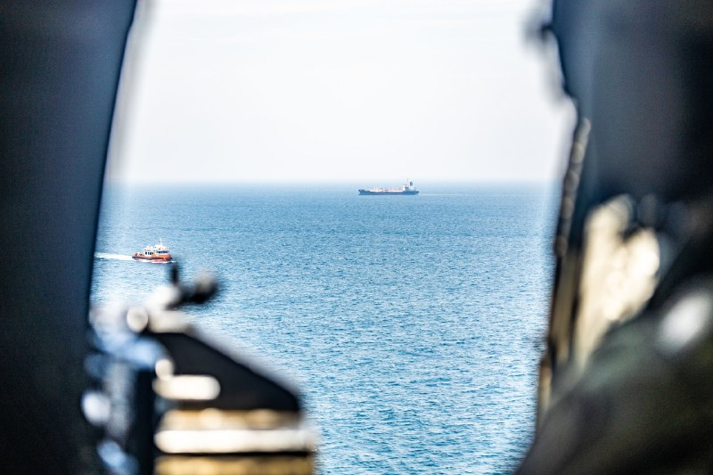
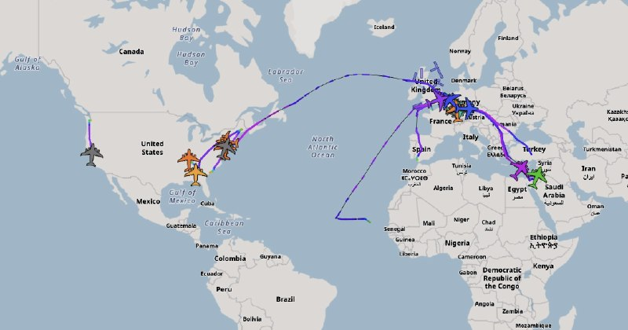
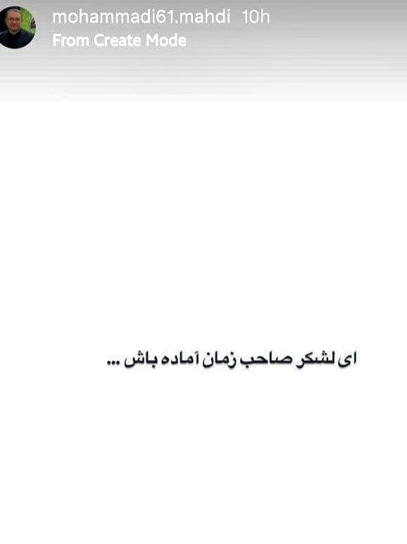
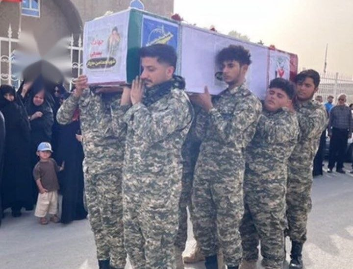
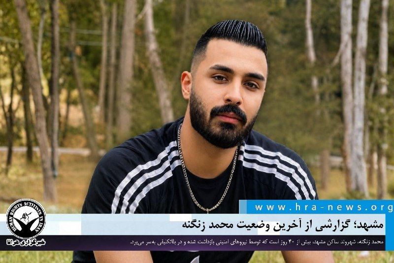

# خواننده تلگرام

<!-- TOP_NAV START -->

<a href="https://github.com/Joblesshox/aio-downloader/blob/main/telegram/content/archive_1.md" style="display:inline-block; padding:6px 12px; margin:0 4px; background-color:#2ea44f; color:white; text-decoration:none; border-radius:4px; font-weight:bold;">صفحه بعد</a>

<!-- TOP_NAV END -->

<!-- MSG START -->

---
📅 بروزرسانی: 1405/02/26 19:09
---

## VahidOOnLine — post 240499

  

♦️ میخاییل اولیانوف، نماینده روسیه در سازمان ملل متحد در ژنو، با بازنشر خبری درباره مخالفت چین با قطعنامه پیشنهادی مورد حمایت ایالات متحده به شورای امنیت سازمان ملل درباره تنگه هرمز، اعلام کرد که موضع روسیه نیز با چین یکسان است.

وزیر خارجه چین پیش‌تر، قطعنامه پیشنهادی علیه جمهوری اسلامی را «نادرست» خوانده و تاکید کرده بود که حل مسئله تنگه هرمز تنها از راه دستیابی به «آتش‌بس دائم و فراگیر» میان تهران و واشنگتن امکان‌پذیر است و استفاده از زور نمی‌تواند مسئله را حل کند.

مایک والتز، نماینده ایالات متحده در سازمان ملل در نیویورک، روز جمعه ۲۶ اردیبهشت اعلام کرد که این قطعنامه که با حمایت آمریکا و کشورهای حوزه خلیج فارس، به شورای امنیت ارائه شده، تاکنون حمایت ۱۲۰ کشور را به‌دست آورده است. با این‌وجود، مخالفت چین و روسیه که حق وتو دارند، مانع بزرگی برای تصویب قطعنامه پیشنهادی است.
‌🇸🇦 Indypersian

🤖 @VahidOOnLine

## VahidOOnLine — post 240498

  

محمدصالح جوکار، رییس کمیسیون امور داخلی مجلس، گفت: «آمریکا به دنبال آن است تا آنچه را که در میدان به دست نیاورده پای میز مذاکره به دست آورد. در این‌باره باید بگویم هرگز آمریکا به خواسته‌های نامشروعش در مذاکرات نخواهد رسید.»

جوکار گفت که آمریکا باید شروط تهران را برای توافق بپذیرد و راهی جز تعظیم در برابر خواسته‌های جمهوری اسلامی ندارد
‌🏁 🇬🇧 IranintlTV

🤖 @VahidOOnLine

## VahidOOnLine — post 240497

♦️در حالی که دونالد ترامپ، رئیس‌جمهوری ایالات متحده سفر خود به پکن را پایان داده و به آمریکا بازگشته است، حاشیه‌های این سفر ادامه دارد. یکی از این موارد، تصاویری از لحظه‌ای که ترامپ، نگاهی به یادداشت‌های شی جین‌پینگ، رئیس‌جمهوری چین می‌اندازد است که دستاویز طنزپردازان شده است. یک شبکه اینترنتی چینی، با انتشار این تصاویر، ترامپ را با عنوان «مامور ۰۰۴۷» که اشاره به اسم رمز جیمز باند، شخصیت مشهور کتاب‌های جاسوسی بریتانیایی دارد، خطاب کرده است.
‌🇸🇦 Indypersian

🤖 @VahidOOnLine

## VahidOOnLine — post 240496

  <a href="telegram/content/VahidOOnLine_240496_1778945993.mp4" target="_blank">🎬 Download video</a>

‌
اشتوتگارت | آلمان؛ گردهمایی ایرانیان - گزارشگر شنبه ۲۶ اردیبهشت
‌🏁 🇬🇧 ManotoTV

🤖 @VahidOOnLine

## VahidOOnLine — post 240495

♦️ پادشاه خودخوانده سوئیس که خود را «شاه یوناس اول» می‌نامد، با وجود جنجال‌های فراوان، همچنان به گسترش نفوذ خود ادامه می‌دهد. یوناس لاووینر، شهروند ۳۱ ساله سوئیسی-مراکشی، در سال ۲۰۱۹ طی مراسمی در کلیسای نایدگ شهر برن تاج‌گذاری کرد و خود را «پادشاه نمادین سوئیس» نامید؛ عنوانی که در کشوری بدون سنت سلطنتی و بدون خانواده سلطنتی رسمی، بحث‌برانگیز بوده است.

لاووینر که در یک شرکت داروسازی نیز مشغول به کار است، طی سال‌های اخیر با استفاده از یک خلا در قوانین سوئیس توانسته حدود ۱۱۷ هزار متر مربع زمین بدون مالک را در نقاط مختلف کشور به نام خود ثبت کند. او اکنون مالک حدود ۱۵۰ قطعه زمین، از جمله ۸۳ جاده، است و می‌گوید روزانه بیش از ۵ هزار نفر از جاده‌های متعلق به او استفاده می‌کنند.

فعالیت‌های او باعث درگیری‌های حقوقی با مقام‌های محلی شده است. در یکی از موارد، او برای واگذاری خیابانی در منطقه گئونزه خواستار پرداخت ۱۵۰ هزار فرانک یا تغییر نام آن به «خیابان لاووینر» شده است؛ پیشنهادی که رد شد و به شکایت قضایی انجامید.
‌🇸🇦 Indypersian

🤖 @VahidOOnLine

## VahidOOnLine — post 240494

♦️پیت هگست، وزیر جنگ ایالات متحده، از خدمه ناو هواپیمابر «یو‌اس‌اس جرالد فورد» پس از بازگشت از یک ماموریت طولانی استقبال کرد.
این ناو پس از بیش از ۳۰۰ روز استقرار در مناطق تحت مسئولیت فرماندهی مرکزی ارتش آمریکا (سنتکام) و فرماندهی ارتش جنوبی (SOUTHCOM)، به پایگاه خود بازگشته است. در این مدت، این ناو در عملیات‌ها و ماموریت‌های مختلف نظامی حضور داشته است.
هگست در این مراسم با قدردانی از عملکرد خدمه، این ماموریت را یکی از طولانی‌ترین و مهم‌ترین استقرارهای دریایی اخیر توصیف کرد.
‌🇸🇦 Indypersian

🤖 @VahidOOnLine

## VahidOOnLine — post 240493

  <a href="telegram/content/VahidOOnLine_240493_1778945994.mp4" target="_blank">🎬 Download video</a>

یک دانش‌آموز در پیام به ایران اینترنشنال با اشاره به مجازی شدن آموزش می‌گوید باید برای مدرسه‌ای که نرفتیم ۱۵۰ میلیون تومان شهریه بدهیم. پیام این دانش‌آموز با هوش مصنوعی بازخوانی شده است.
‌🏁 🇬🇧 IranintlTV

🤖 @VahidOOnLine

## VahidOOnLine — post 240492

  

خبرگزاری آناتولی ترکیه گزارش داد که هاکان فیدان، وزیر خارجه ترکیه، با علی باقری‌کنی، معاون بین‌الملل دبیرخانه شورای عالی امنیت ملی، روز شنبه در استانبول دیدار کرد. این خبرگزاری اعلام کرد جزئیات بیشتری از این دیدار منتشر نشده است.
‌🏁 🇬🇧 IranintlTV

🤖 @VahidOOnLine

## VahidOOnLine — post 240491

  <a href="telegram/content/VahidOOnLine_240491_1778945996.mp4" target="_blank">🎬 Download video</a>

دوسلدورف | آلمان؛ گردهمایی ایرانیان - گزارشگر شنبه ۲۶ اردیبهشت
‌🏁 🇬🇧 ManotoTV

🤖 @VahidOOnLine

## VahidOOnLine — post 240490

  <a href="telegram/content/VahidOOnLine_240490_1778945998.mp4" target="_blank">🎬 Download video</a>

پرث استرالیا، تجمع ایرانیان، شنبه ۲۶ اردیبهشت
‌🏁 🇬🇧 ManotoTV

🤖 @VahidOOnLine

## VahidOOnLine — post 240489

  

العربیه به نقل از منابعی خبر داد که سفر محسن نقوی، وزیر کشور پاکستان، به ایران با هدف رسیدن به چارچوب یک توافق انجام شده است. بر اساس این گزارش، پیشرفت مثبتی درباره تنگه هرمز حاصل شده و درها برای مذاکره درباره موارد باقی‌مانده از جمله موضوع هسته‌ای، باز است
‌🏁 🇬🇧 IranintlTV

🤖 @VahidOOnLine

## VahidOOnLine — post 240488

  

♦️ خبرگزاری صداوسیمای جمهوری اسلامی، روز شنبه ۲۶ اردیبهشت در گزارشی اختصاصی اعلام کرد که «چند کشور اروپایی» به‌دنبال انجام امور اداری و دریافت «تاییدیه» از تهران هستند تا بتوانند شناورهایشان را از تنگه هرمز عبور دهند.

این خبرگزاری با اشاره به گزارش‌ها از عبور موفق نفتکش‌هایی از چین، ژاپن و پاکستان از مسیر تعیین شده از سوی جمهوری اسلامی، تاکید کرد که این عبورها با «اجازه نیروی دریایی ایران» انجام شده است. صداوسیما نام این «کشورهای اروپایی» را اعلام نکرد.
‌🇸🇦 Indypersian

🤖 @VahidOOnLine

## VahidOOnLine — post 240487

  <a href="telegram/content/VahidOOnLine_240487_1778946000.mp4" target="_blank">🎬 Download video</a>

♦️مایک والتز، سفیر ایالات متحده در سازمان ملل، در گفت‌وگو با فاکس‌نیوز تأکید کرد که نقض هنجارهای بین‌المللی در تنگه‌های مهم دریایی قابل پذیرش نیست و کشورها نمی‌توانند در واکنش به درگیری‌ها اقدام به مین‌گذاری یا دریافت عوارض از مسیرهای بین‌المللی کنند.
او با اشاره به تحولات اخیر گفت چین پس از دیدار با رئیس جمهوری، مواضعی اتخاذ کرده که نشان‌دهنده فاصله‌گیری از ایران است. والتز افزود پکن با «عدم دستیابی ایران به سلاح هسته‌ای» و «عدم نظامی‌سازی تنگه هرمز» موافقت کرده است.
 سفیر آمریکا گفت چین همچنین تاکید کرده که تنگه‌هایی مانند هرمز و جبل‌الطارق نباید به‌عنوان ابزار درآمدزایی یا فشار سیاسی مورد استفاده قرار گیرند.
والتز این موضع را «دستاوردی مهم» در چارچوب تحولات دیپلماتیک اخیر توصیف کرد.
‌🇸🇦 Indypersian

🤖 @VahidOOnLine

## VahidOOnLine — post 240486

  <a href="telegram/content/VahidOOnLine_240486_1778946001.mp4" target="_blank">🎬 Download video</a>

دوسلدورف آلمان، تجمع ایرانیان، شنبه ۲۶ اردیبهشت
‌🏁 🇬🇧 ManotoTV

🤖 @VahidOOnLine

## VahidOOnLine — post 240485

  <a href="telegram/content/VahidOOnLine_240485_1778946002.mp4" target="_blank">🎬 Download video</a>

ملبورن، تجمع ایرانیان، ۲۶ اردیبهشت
‌🏁 🇬🇧 ManotoTV

🤖 @VahidOOnLine

## VahidOOnLine — post 240484

  <a href="telegram/content/VahidOOnLine_240484_1778946003.mp4" target="_blank">🎬 Download video</a>

هامبورگ، راهپیمایی ایرانیان و حمایت از زندانیان سیاسی، ۲۶ اردیبهشت
‌🏁 🇬🇧 ManotoTV

🤖 @VahidOOnLine

## VahidOOnLine — post 240483

  

سنتکام، مرکز فرماندهی ایالات متحده، اعلام کرد که از آغاز محاصره سواحل جنوب ایران تا کنون، ۷۸ کشتی تجاری وادار به تغییر مسیر شده‌اند و ۴ کشتی برای تضمین اجرای محاصره از کار افتاده‌اند.

سنتکام با انتشار نمایی از داخل یک بالگرد بر فراز آب‌های منطقه‌ای نزدیک تنگه هرمز، نوشت که این بالگرد ارتش آمریکا کشتی‌های تجاری را در جریان اجرای محاصره دریایی ایران زیر نظر دارد.
‌🏁 🇬🇧 IranintlTV

🤖 @VahidOOnLine

## VahidOOnLine — post 240482

  

ایلا واویه، سخنگوی ارتش اسرائیل برای رسانه‌های عربی، در پیامی نوشت لبنان «میان چنگ ملایان و رشته‌های وابستگی» از یک کشور به گروگان تبدیل شده است.

او نوشت زمانی که جنگ‌ها «با انگشتان ایرانی اداره می‌شود»، مردم لبنان بهای آن را با «ویرانی و خاکستر» می‌پردازند.

واویه همچنین اعلام کرد لبنان به سکویی تبدیل شده و حزب‌الله «رشته‌هایی است که از سوی تهران حرکت داده می‌شود» و نتیجه این وضعیت، به گفته او، «کشوری که سیاه‌پوش می‌شود و بی‌گناهانی که جز آینده‌ای نامعلوم سهمی ندارند» است.

سخنگوی ارتش اسرائیل در پایان پرسید: «لبنان به کجا می‌رود؟ و تا کی؟»
‌🏁 🇬🇧 IranintlTV

🤖 @VahidOOnLine

## VahidOOnLine — post 240481

  <a href="telegram/content/VahidOOnLine_240481_1778946006.mp4" target="_blank">🎬 Download video</a>

ایرانیان سوئیس روز شنبه با تجمع در شهر برن به حمایت از انقلاب ملی و شاهزاده رضا پهلوی پرداختند و شعار «جاوید شاه» سر دادند.
‌🏁 🇬🇧 IranintlTV

🤖 @VahidOOnLine

## VahidOOnLine — post 240480

  <a href="telegram/content/VahidOOnLine_240480_1778946008.mp4" target="_blank">🎬 Download video</a>

در واکنش به نمایش و آموزش کار با سلاح در صداوسیما یک شهروند در پیامی به ایران اینترنشنال این اقدام را نشانه سقوط حکومت خواند و مخاطبی دیگر به حرکت مشابه در لیبی قبل از سقوط حکومت معمر قذافی اشاره کرد.

پیام این مخاطبان با هوش مصنوعی بازخوانی شده است.
‌🏁 🇬🇧 IranintlTV

🤖 @VahidOOnLine

## WithYashar — post 11403

العربیه: طبق گفته منابع آگاه پاکستانی، در بحث تنگه هرمز، پیشرفت‌هایی حاصل شده است
@withyashar

## WithYashar — post 11402

  <a href="telegram/content/WithYashar_11402_1778946010.mp4" target="_blank">🎬 Download video</a>

دوئل نهایی ، وضعیت الان!
@withyashar

## WithYashar — post 11401

عرزشی ها اومدن که خبر مرگ بابای سپاهیشون رو زودتر تو چنلت ببینن
اخه از رسانه های دیگه ۱ ساعت حداقل جلوتری ستون😂🔥

## WithYashar — post 11400

  

پست جدید ترامپ :

شوخی نداریم!!!
ببین قراره بعدش تو موضوع مورد علاقت چه اتفاقی بیفته!
@withyashar

## WithYashar — post 11399

سقوط یک شهر پاکستان به دست جدایی‌طلبان

منابع محلی روز شنبه از تسلط جدایی‌طلبان بلوچ بر شهر راهبردی دالبندین در پاکستان خبر می‌دهند.
@withyashar

## WithYashar — post 11398

فقط برای یک پست که نمیشه ببندم مهندس ! کلا ببندمم که یعنی میگی خنده رو از روی لب چندین هزار نفر بگیرم به خاطر ده نفر. ما اینجا هدف اصلیمون مبارزه با اخبار سمیه و روحیه دادن به مردم. اجازه بدید در عرزشی سوزترین رسانه ایرانی بسوزند و حرص بخورند

## WithYashar — post 11397

میتونی ری‌اکشن رو هم ببندی داداش!

## WithYashar — post 11396

این پست اوناییکه استیکر خنده گذاشتن رو از کانال مسدودشون کن

## WithYashar — post 11395

این پست اوناییکه استیکر خنده گذاشتن رو از کانال مسدودشون کن

## WithYashar — post 11394

لازم به ذکر است شخص اینجانب ، یاشار در اتاق جنگ هیچ رابطه و تیمکشی با هیچ گروه جناح و سمتی ندارم مسیر من مسیر مانوک خدابخشیان و فریدون فرخزاد است و هم پیمانان من فقط مردم واقعی و وطن پرست ایران هستند و برگ برنده ما همه با هم اینجا برای عبور از مسیر فقط فقط فقط خود شخص شاهزاده رضا پهلوی است ، یک بار دیگه خواستم اهداف و مسیر خودم را مشخص و کلیر کنم
@withyashar

## WithYashar — post 11393

مشاورین شاهزاده (امیر اعتمادی و سعید قاسمینژاد) ، علی کریمی‌ رو به علت واکنش ‌به کنسرت و آهنگ شاهین نجفی آنفالو کردند
@withyashar

## WithYashar — post 11392

  

روز جهانی پسر بچه … به یاد جاوید نام های کوچکمون مبارزه میکنیم تا نسل جدید این درد ها رو نکشه !
@withyashar

## WithYashar — post 11390

ایسنا: وزیر کشور پاکستان برای دیدار با مسئولان جمهوری اسلامی ساعاتی قبل به تهران سفر کرده.
@withyashar

## WithYashar — post 11389

کانال ۱۲ اسرائیل مدعی شد: ترامپ بزودی با اعضای کابینه خود جلسه اضطراری برای پایان دادن به اوضاع ایران برگزار میکند.
@withyashar

## mwarmonitor — post 9160

  

‼️من همین حالا یک ناو هواپیمابر کلاس نیمیتز (احتمالاً USS George H. W. Bush یا USS Abraham Lincoln) را در تصاویر ماهواره‌ای Sentinel-2 مربوط به 16/05/2026 پیدا کردم. 🔸این ناو با سرعت به سمت شمال دریای عمان در حال حرکت است. @mwarmonitor

## mwarmonitor — post 9159

  

🇺🇸یک فروند بالگرد ارتش ایالات متحده هنگام پرواز بر فراز آب‌های منطقه‌ای نزدیک تنگه هرمز، بر حرکت کشتی‌های تجاری نظارت می‌کند. این اقدام در چارچوب اجرای محاصره دریایی آمریکا علیه ایران انجام می‌شود.

🔸تا تاریخ ۱۶ مه، ۷۸ کشتی تجاری تغییر مسیر داده شده‌اند و ۴ کشتی برای تضمین تبعیت از دستورها از کار افتاده‌اند.

@mwarmonitor

## mwarmonitor — post 9158

  <a href="telegram/content/mwarmonitor_9158_1778946013.mp4" target="_blank">🎬 Download video</a>

📝تحلیل اختصاصی کانال

🇵🇰🇮🇷سفر از پیش‌اعلام‌نشده وزیر کشور پاکستان به تهران، بیش از آنکه یک رایزنی سنتی باشد، یک آفند دیپلماتیک پیشگیرانه است. در عرف بین‌الملل، حضور فیزیکی یک مقام ارشد از کشوری غیردرگیر در پایتختِ هدف، به عنوان یک ضربه‌گیر امنیتی عمل می‌کند؛ چرا که واشنگتن برای اجتناب از تصاعد بحران و درگیر کردن پای اسلام‌آباد، دست به اقدام نظامی ناگهانی نخواهد زد.

🔸این تحرک در کوتاه‌مدت به شدت تأثیرگذار است و عملاً زمان حیاتی برای تنش‌زدایی یا بازدارندگی موقت ایجاد می‌کند. با این حال، کارآمدی بلندمدت آن بستگی به این دارد که تهران و اسلام‌آباد از این فرصتِ تنفس و «سپر دیپلماتیک» برای تغییر محاسبات واشنگتن بهره ببرند، یا اینکه این سفر تنها یک مسکن موقت برای به تعویق انداختن بحران باشد.

@mwarmonitor

## mwarmonitor — post 9157

  <a href="telegram/content/mwarmonitor_9157_1778946015.mp4" target="_blank">🎬 Download video</a>

🇺🇸با ورود وزیر جنگ آمریکا، پیت هگست، به نورفولک، ویرجینیا، ناو هواپیمابر «یو‌اس‌اس جرالد آر. فورد» پس از یک استقرار بیش از ۳۰۰ روزه به پایگاه خانگی خود بازگشت. این ناو و شناورهای همراه آن در طول این مدت در عملیات‌های رزمی در دو فرماندهی رزمی (COCOM) شامل SOUTHCOM و CENTCOM شرکت داشتند.

@mwarmonitor

## mwarmonitor — post 9156

  

‼️من همین حالا یک ناو هواپیمابر کلاس نیمیتز (احتمالاً USS George H. W. Bush یا USS Abraham Lincoln) را در تصاویر ماهواره‌ای Sentinel-2 مربوط به 16/05/2026 پیدا کردم.

🔸این ناو با سرعت به سمت شمال دریای عمان در حال حرکت است.

@mwarmonitor

## mwarmonitor — post 9155

  

✈️🇺🇸نیروی هوایی آمریکا (USAF) – جنگ ایران ۲۰۲۶ | ۱۶ مه

✈️تعداد پروازهای ورودی هواپیماهای ترابری C-17 به منطقه فرماندهی مرکزی آمریکا (CENTCOM) و پایگاه‌های مرتبط به دست‌کم 1,320 پرواز رسیده و 10 پرواز دیگر نیز در حال انجام است.

✈️8 مورد از این پروازهای جدید از پایگاه هوایی Pope Army Airfield آمریکا انجام شده‌اند و مقصد مشخصی برای آن‌ها قابل شناسایی نیست.

✈️حداقل 6 پرواز جدید نیز به‌نظر می‌رسد حرکت‌های خروجی از CENTCOM به سمت پایگاه‌هایی در خاک آمریکا (CONUS) باشند؛ همان پایگاه‌هایی که بیشتر پروازها از آن‌ها آغاز شده‌اند.

@mwarmonitor

## mwarmonitor — post 9154

⚠️اطلاعیه فوری ⚠️

⚠️"با نزدیک شدن به لحظه درگیری‌های مجدد، ثانیه‌ها سرنوشت‌ساز شده‌اند. اکنون زمان انتخاب میان بقا یا قربانی شدن در راه منافع سران است. از پادگان‌ها و مراکز نظامی فاصله بگیرید و جان خود را فدای وعده‌های توخالی نکنید."

⚠️با توجه به نشانه‌های موجود و احتمال آغاز مجدد درگیری‌های نظامی، حفظ هوشیاری و اتخاذ تصمیمات درست در این لحظات بحرانی برای تمامی گروه‌های جامعه، از شهروندان عادی تا بدنه نیروهای مسلح، امری حیاتی و سرنوشت‌ساز است.

⚠️در همین راستا، به سربازان وظیفه و کادر نظامی توصیه می‌شود که از حضور در پادگان‌ها و مراکز نظامی خودداری کنند. تجربه و تاریخ نشان داده است که در اوج بحران‌ها، سران و تصمیم‌گیرندگان اصلی ساختار با تضمین مسیرهای خروج خود به کشورهای هم‌پیمان مانند چین و روسیه، بدنه رده‌پایین و نیروهای فریب‌خورده را به عنوان سپر بلا در میدان رها می‌کنند؛ بنابراین عاقلانه‌ترین راه، فاصله گرفتن از نظام و ایستادن در سمت درست تاریخ یعنی در کنار مردم است.

⚠️همچنین از تمامی شهروندان و غیرنظامیان تقاضا می‌شود برای حفظ جان خود، فوراً از نزدیکی زیرساخت‌های انرژی از جمله پالایشگاه‌ها و نیروگاه‌ها و همچنین مراکز و پادگان‌های نظامی فاصله بگیرند. در نهایت، با توجه به پیش‌بینی‌ها مبنی بر احتمال تمرکز حملات بر روی امارات متحده عربی، از هموطنان مقیم این کشور درخواست می‌شود که در بالاترین سطح آمادگی و هوشیاری قرار داشته و مراقبت‌های لازم را به عمل آورند.

@mwarmonitor

## mwarmonitor — post 9153

  <a href="telegram/content/mwarmonitor_9153_1778946017.mp4" target="_blank">🎬 Download video</a>

🔴اختصاصی ‌CNN از پل ویران‌شده کرج در ایران بازدید می‌کند؛ هم‌زمان با تجدید تهدیدها از سوی دونالد ترامپ.

@mwarmonitor

## mwarmonitor — post 9152

🇺🇸امشب با دستور من، نیروهای شجاع آمریکایی و نیروهای مسلح نیجریه، ماموریتی به‌دقت برنامه‌ریزی‌شده و بسیار پیچیده را برای حذف فعال‌ترین تروریست جهان از صحنه نبرد، به‌طور بی‌نقصی اجرا کردند. «ابوبلال المینوکی»، شخص دوم در فرماندهی جهانی داعش، فکر می‌کرد که می‌تواند…

## FoxNewsTwitter — post 341817

  <a href="telegram/content/FoxNewsTwitter_341817_1778946019.mp4" target="_blank">🎬 Download video</a>

Fox News (Twitter/X)

NEW: @VP lays out in blunt terms who the victims are when fraudsters target benefits Americans rely on most on @SatAmericaFNC.

“There really are two costs and two victims. One is taxpayers getting fleeced... But it’s also there’s these programs that people in my family that I have benefited from that are meant to provide food to low income kids, are meant to ensure that if you can’t afford a doctor, you can still have access to medical care. Those programs are going to be destroyed by the fraudsters.”

## FoxNewsTwitter — post 341816

  <a href="telegram/content/FoxNewsTwitter_341816_1778946021.mp4" target="_blank">🎬 Download video</a>

Fox News (Twitter/X)

RT @SatAmericaFNC: 🚨EXCLUSIVE: @KayleighMcEnany asks Vice President JD Vance if Newsom has contacted the administration to help investigate fraud in his state.

@VP @Vance says, "I would love it if Gavin Newsom had a come-to-Jesus moment and said, 'You know what, I’m going to take this fraud issue seriously.'”

## FoxNewsTwitter — post 341815

  <a href="telegram/content/FoxNewsTwitter_341815_1778946022.mp4" target="_blank">🎬 Download video</a>

Fox News (Twitter/X)

RT @SatAmericaFNC: 🚨EXCLUSIVE: @KayleighMcEnany presents a whistleblower report alleging that some Medicaid fraud proceeds in Minnesota may have been siphoned overseas to designated terrorist organizations.

@VP @JDVance responds, “We will IMMEDIATELY take that to the team because that should be a COUNTERTERRORISM investigation.”⬇️

## FoxNewsTwitter — post 341814

‌Fox News (Twitter/X)

BREAKING NEWS: Trump unloaded on Sen. Bill Cassidy ahead of Louisiana’s GOP primary election, calling him a “disloyal disaster” and a “sleazebag,” while urging voters to support Julia Letlow.

https://www.foxnews.com/politics/trump-blasts-sen-bill-cassidy-disloyal-disaster-pushes-challenger-julia-letlow-louisiana-gop-primary

## FoxNewsTwitter — post 341813

  

Fox News (Twitter/X)

Today, the nation honors the brave men and women of the United States Armed Forces, recognizing their courage, sacrifice, and unwavering commitment to defending America.

"As we celebrate 250 glorious years of American independence this year, we acknowledge that our precious freedom, enjoyed and embraced by generation after generation, has been secured for all citizens by the providence and grace of Almighty God and the service and sacrifice of every member of our military," a White House statement reads.

## FoxNewsTwitter — post 341812

  <a href="telegram/content/FoxNewsTwitter_341812_1778946024.mp4" target="_blank">🎬 Download video</a>

Fox News (Twitter/X)

NEW: U.S. Africa Command releases video of the airstrike that targeted and eliminated ISIS fighters in Nigeria, including ISIS second-in-command Abu-Bilal al-Minuki.

President Trump called the “meticulously planned and very complex mission” a complete success.

## FoxNewsTwitter — post 341811

  

Fox News (Twitter/X)

A retired Navy admiral warns UFOs may be controlled by a “higher-order non-human intelligence.”

Tim Gallaudet, considered to be one of America’s leading voices on the UAP phenomenon, says he’s seen “data videos” showing craft moving seamlessly between the ocean and atmosphere at speeds beyond known technology.

“I know we are aware of higher order non-human intelligence that direct the movement of these phenomena,” he said.

## FoxNewsTwitter — post 341810

  

Fox News (Twitter/X)

A retired Navy admiral warns UFOs may be controlled by a “higher-order non-human intelligence.”

Tim Gallaudet, considered to be one of America’s leading voices on the UAP phenomenon, says he’s seen “data videos” showing craft moving seamlessly between the ocean and atmosphere at speeds beyond known technology.

“I know we are aware of higher order non-human intelligence that direct the movement
of these phenomena,” he said.

## FoxNewsTwitter — post 341809

  <a href="telegram/content/FoxNewsTwitter_341809_1778946027.mp4" target="_blank">🎬 Download video</a>

Fox News (Twitter/X)

Empty Waymo cars swarm an Atlanta neighborhood, repeatedly circling cul-de-sacs and leaving residents frustrated and confused.

One local estimated nearly 50 self-driving cars rolled through the area in a single morning, with several clogging the road as they struggled to maneuver around one another.

Waymo said it had “already addressed this routing behavior.”

## FoxNewsTwitter — post 341808

  <a href="telegram/content/FoxNewsTwitter_341808_1778946029.mp4" target="_blank">🎬 Download video</a>

Fox News (Twitter/X)

Bodycam video captures the terrifying moment officials say a Florida deputy was attacked almost instantly after arriving on-scene.

Marion County Sheriff's Office Deputy Robert Fitch had just stopped to investigate a suspicious-person call on a residential street in Ocala, Florida on May 13. After exiting his vehicle, a man lunges at him and Fitch falls to the ground.

Fitch was stabbed several times in his bulletproof vest, suffering minor injuries, before the man fled into the woods, officials say.

The suspect, Heriberto Medina Marquez, was apprehended a short time later and reportedly faces charges of attempted murder of a law enforcement officer.

## pm_afshaa — post 90853

جهت تبلیغات با بازدهی بالا میتونین دایرکت کانال پیام بدین

## pm_afshaa — post 90852

  <a href="telegram/content/pm_afshaa_90852_1778946030.webm" target="_blank">🎬 Download video</a>

🔴پست جدید ترامپ در تروث سوشال:
شوخی نداریم!!! ببین قراره بعدش تو موضوع مورد علاقت چه اتفاقی بیفته!

💧 Rainbet.com the #1 Non-KYC Crypto Casino & Sportsbook @rainbetcom

😁 @Pm_Afshaa

## pm_afshaa — post 90851

  <a href="telegram/content/pm_afshaa_90851_1778946031.webm" target="_blank">🎬 Download video</a>

🔴ایسنا: وزیر کشور پاکستان برای دیدار با مسئولان جمهوری اسلامی ساعاتی قبل به تهران سفر کرده. 
💧 Rainbet.com the #1 Non-KYC Crypto Casino & Sportsbook @rainbetcom 
😁 @Pm_Afshaa

## pm_afshaa — post 90850

  <a href="telegram/content/pm_afshaa_90850_1778946031.webm" target="_blank">🎬 Download video</a>

🔴استوری مشاور قالیباف همزمان با بالا گرفتن احتمال شروع مجدد جنگ :

💧 Rainbet.com the #1 Non-KYC Crypto Casino & Sportsbook @rainbetcom

😁 @Pm_Afshaa

## pm_afshaa — post 90849

  <a href="telegram/content/pm_afshaa_90849_1778946032.webm" target="_blank">🎬 Download video</a>

🔴الحدث به نقل از منابع پاکستانی:
اسلام آباد به دنبال ادامه روند میانجیگری با جدییت است. اسلام آباد به دنبال متقاعد کردن تهران و واشنگتن به انعطاف پذیری در مذاکراته

💧 Rainbet.com the #1 Non-KYC Crypto Casino & Sportsbook @rainbetcom

😁 @Pm_Afshaa

## pm_afshaa — post 90848

  

مجری‌های صداوسیما در چند برنامه زنده، با اسلحه کلاشینکف حضور پیدا کردن : 
💧 Rainbet.com the #1 Non-KYC Crypto Casino & Sportsbook @rainbetcom 
😁 @Pm_Afshaa

## pm_afshaa — post 90847

🔴کانال 12 اسرائیل: اسرائیل در حال آماده شدن برای یک جنگ چند روزه یا چند هفته‌ای با ایران است

💧 Rainbet.com the #1 Non-KYC Crypto Casino & Sportsbook @rainbetcom

😁 @Pm_Afshaa

## pm_afshaa — post 90846

  <a href="telegram/content/pm_afshaa_90846_1778946032.webm" target="_blank">🎬 Download video</a>

🔴ایسنا: وزیر کشور پاکستان برای دیدار با مسئولان جمهوری اسلامی ساعاتی قبل به تهران سفر کرده.

💧 Rainbet.com the #1 Non-KYC Crypto Casino & Sportsbook @rainbetcom

😁 @Pm_Afshaa

## iaghapour — post 2615

  

⭕️ آموزش نصب ساده و آفلاین 3X-UI روی سرور ایران + SSL (+ معرفی قابلیت های جدید)

🔹در این ویدیو به سراغ یکی از بزرگترین چالش‌های این روزها رفتیم: نصب پنل 3X-UI روی سرورهای ایران همراه با سرتیفیکیت به صورت کاملاً آفلاین و بدون نیاز به اینترنت آزاد! همینطور سعی کردیم یک معرفی ساده از قابلیت های جدید این پنل داشته باشیم.

🔗 لینک ویدیو در یوتیوب

🔗 دانلود ویدیو با لینک مستقیم (بزودی)

#آموزش #فیلترشکن #پنل #xui #3xui
برای دور زدن فیلترینگ و آموزش تکنولوژی و هوش مصنوعی ما رو دنبال کنید 💚
🆔@iaghapour

## DEJradio — post 4667

  <a href="telegram/content/DEJradio_4667_1778946033.mp4" target="_blank">🎬 Download video</a>

🚨
🔸 امیررضا نصرآزادانی، فوتبالیست زندانی حامی معترضان و آزادی‌خواهان، در پیامی از درون زندان، از ایرانیان خواسته او را فراموش نکنند.

#امیررضا_نصرآزادانی #فوتبالیست_مردمی
@DEJradio

## VahidOnline — post 75501

  <a href="telegram/content/VahidOnline_75501_1778946035.mp4" target="_blank">🎬 Download video</a>

دختر جمیله شفیعی: JamilehShafiei

📡 @VahidOnline

## VahidOnline — post 75500

  <a href="telegram/content/VahidOnline_75500_1778946035.mp4" target="_blank">🎬 Download video</a>

"مجری شبکه سه تلویزیون: یک راکت ۲۰۰ دلاری می‌تواند کل ارتش آمریکا را در منطقه به زانو درآورد" ویدیو با تیتر بالا در منابع جمهوری اسلامی منتشر شده و خانعلی‌زاده متوهم رو نشون میده که مطابق معمول چرندیاتی در سطح خودش میگه. 📡 @VahidOnline

## VahidOnline — post 75499

  <a href="telegram/content/VahidOnline_75499_1778946035.mp4" target="_blank">🎬 Download video</a>

در یک برنامه زنده تلویزیونی که از شبکه افق صداوسیما پخش شده است، مجری برنامه با اسلحه واقعی به پرچم امارات متحده عربی شلیک می‌کند.
در این برنامه که موضوع آن درباره آموزش شلیک با اسلحه کلاشنیکف است، فردی که لباس نظامی به تن دارد و صورت خود را با ماسک پوشانده است مراحل آماده‌سازی اسلحه و شلیک گلوله را به مجری آموزش می‌دهد.
مجری برنامه هم در مرحله شلیک تصمیم می‌گیرد به پرچم امارات که در بنر مربوط به دکور استودیو، شلیک کند.
@VahidHeadline
صدا و سیمای جمهوری اسلامی جمعه چند برنامه پخش کرد که در آنها مجریان در بخش‌های استودیویی با در دست داشتن تفنگ ظاهر شدند و کار با سلاح‌های سبک آموزش داده شد. مجریان در این برنامه‌ها اعلام کردند که در صورت لزوم به جنگ خواهند پیوست.
این برنامه‌ها که دست‌کم در سه بخش پخش شد، در رسانه‌های داخلی بازنشر و در شبکه‌های اجتماعی با واکنش‌هایی همراه شد. برخی کاربران شبکه‌های اجتماعی این بخش‌ها را نشانه‌ای از بسیج در شرایط جنگی توصیف کردند.
جکسون هینکل، مفسر سیاسی آمریکایی، در شبکه اجتماعی ایکس نوشت تلویزیون دولتی ایران نحوه استفاده و شلیک با کلاشینکف را به‌عنوان «آمادگی برای تهاجم زمینی آمریکا» نشان می‌دهد.
@VahidOOnLine

📡 @VahidOnline

## VahidOnline — post 75498

  

رسانه وابسته به قوه قضائیه جمهوری اسلامی اعلام کرد اموال ۵۱ نفر در استان یزد، با دستور قضایی و به اتهام آنچه «خیانت به وطن» و «همکاری با دشمن» خوانده شده، توقیف شده است.

بر اساس این گزارش، پرونده این افراد در ارتباط با قانون موسوم به «تشدید مجازات جاسوسی و همکاری با رژیم صهیونیستی علیه امنیت و منافع ملی» در حال رسیدگی است و مقام‌های قضایی مدعی شده‌اند دارایی‌های توقیف‌شده قرار است برای «حفظ حقوق عامه» و بازسازی اماکن آسیب‌دیده از جنگ هزینه شود.

اموال توقیف‌شده شامل حساب‌های بانکی، دارایی‌های منقول و غیرمنقول، سهام شرکت‌ها و حتی اموال وکالتی عنوان شده است.

طبق گزارش میزان، از میان این ۵۱ نفر، ۲۰ نفر در داخل کشور حضور دارند و ۳۱ نفر دیگر در خارج از کشور به سر می‌برند.

این اقدام در ادامه موج تازه‌ای از مصادره و توقیف اموال شهروندان و مخالفان سیاسی صورت می‌گیرد؛ روندی که در عمل به ابزاری برای فشار، ارعاب و مصادره دارایی افراد تحت عنوان‌های سنگینی مانند «خیانت» و «همکاری با دشمن» تبدیل شده است.
@VahidHeadline

📡 @VahidOnline

## IranIntlTV — post 337494

  

محمدصالح جوکار، رییس کمیسیون امور داخلی مجلس، گفت: «آمریکا به دنبال آن است تا آنچه را که در میدان به دست نیاورده پای میز مذاکره به دست آورد. در این‌باره باید بگویم هرگز آمریکا به خواسته‌های نامشروعش در مذاکرات نخواهد رسید.»

جوکار گفت که آمریکا باید شروط تهران را برای توافق بپذیرد و راهی جز تعظیم در برابر خواسته‌های جمهوری اسلامی ندارد
https://iranintl.com/202605165329

## IranIntlTV — post 337493

  <a href="telegram/content/IranIntlTV_337493_1778946037.mp4" target="_blank">🎬 Download video</a>

صداوسیمای جمهوری اسلامی در برنامه‌ای آموزش استفاده از سلاح گرم توسط یک نظامی به مجری را به نمایش گذاشت. در بخشی از این برنامه، مجری به پرچم امارات متحده عربی شلیک کرد.
گفت‌وگو با فروغ کنعانی، پژوهشگر جامعه‌شناسی
@iranintltv

## IranIntlTV — post 337492

  <a href="telegram/content/IranIntlTV_337492_1778946038.mp4" target="_blank">🎬 Download video</a>

وزیر کشور پاکستان برای دیدار با مقام‌‌های جمهوری اسلامی وارد تهران شد. همزمان رسانه‌های ایران گزارش دادند محسن نقوی در دیدار با وزیر کشور جمهوری اسلامی، درباره‌ی ازسرگیری مذاکرات صلح، گفت‌وگوهای مفصلی انجام داده‌اند.

گفت‌وگو با جمشید برزگر، روزنامه‌نگار و تحلیل‌گر سیاسی
@iranintltv

## IranIntlTV — post 337491

  <a href="telegram/content/IranIntlTV_337491_1778946040.mp4" target="_blank">🎬 Download video</a>

یک دانش‌آموز در پیام به ایران اینترنشنال با اشاره به مجازی شدن آموزش می‌گوید باید برای مدرسه‌ای که نرفتیم ۱۵۰ میلیون تومان شهریه بدهیم. پیام این دانش‌آموز با هوش مصنوعی بازخوانی شده است.

## IranIntlTV — post 337490

  

خبرگزاری آناتولی ترکیه گزارش داد که هاکان فیدان، وزیر خارجه ترکیه، با علی باقری‌کنی، معاون بین‌الملل دبیرخانه شورای عالی امنیت ملی، روز شنبه در استانبول دیدار کرد. این خبرگزاری اعلام کرد جزئیات بیشتری از این دیدار منتشر نشده است.
https://iranintl.com/202605168367

## IranIntlTV — post 337489

  <a href="telegram/content/IranIntlTV_337489_1778946042.mp4" target="_blank">🎬 Download video</a>

ایرانیان مقیم استکهلم، شنبه ۲۶ اردیبهشت در حمایت از انقلاب ملی تجمع کردند. تجمع‌کنندگان ضمن حمایت از شاهزاده رضا پهلوی، می‌گویند هدف از برگزاری این تجمعات، رساندن صدای مردم ایران به جهان است.

مهران عباسیان، خبرنگار ایران‌اینترنشنال، گزارش می‌دهد
@iranintltv

## IranIntlTV — post 337488

  <a href="telegram/content/IranIntlTV_337488_1778946044.mp4" target="_blank">🎬 Download video</a>

سرخط خبرهای شنبه ۲۶ اردیبهشت
@iranintltv

## IranIntlTV — post 337487

  <a href="telegram/content/IranIntlTV_337487_1778946045.mp4" target="_blank">🎬 Download video</a>

در یکی دیگر از آخر هفته‌های اعتراضی ایرانیان خارج از کشور، شنبه ۲۶ اردیبهشت تجمعات و راهپیمایی‌های گسترده‌ای در شهرهای مختلف اروپا در حمایت از انقلاب ملی مردم ایران برگزار شد.

گفت‌وگوی احمد صمدی ، خبرنگار ایران‌اینترنشنال، با شرکت‌کنندگان در تجمع برلین
@iranintltv

## IranIntlTV — post 337486

  

العربیه به نقل از منابعی خبر داد که سفر محسن نقوی، وزیر کشور پاکستان، به ایران با هدف رسیدن به چارچوب یک توافق انجام شده است. بر اساس این گزارش، پیشرفت مثبتی درباره تنگه هرمز حاصل شده و درها برای مذاکره درباره موارد باقی‌مانده از جمله موضوع هسته‌ای، باز است
https://iranintl.com/202605165331

## IranIntlTV — post 337485

  <a href="telegram/content/IranIntlTV_337485_1778946047.mp4" target="_blank">🎬 Download video</a>

در یکی دیگر از آخر هفته‌های اعتراضی ایرانیان خارج از کشور، شنبه ۲۶ اردیبهشت تجمعات و راهپیمایی‌های گسترده‌ای در شهرهای مختلف اروپا در حمایت از انقلاب ملی مردم ایران برگزار شد.

احمد صمدی ، خبرنگار ایران‌اینترنشنال، از برلین گزارش می‌دهند
@iranintltv

## IranIntlTV — post 337484

  <a href="telegram/content/IranIntlTV_337484_1778946049.mp4" target="_blank">🎬 Download video</a>

در ادامه گزارش‌ها از لکه نفتی ایجادشده در اطراف جزیره خارک، وبسایت تانکر ترکرز نوشت این موضوع ناشی از نشت نفت از اسکله غربی این جزیره است. خبرگزاری بلومبرگ نیز نوشت توقف صادرات نفت ایران از خارک، به احتمال زیاد ناشی از نشت اخیر نفت بوده است.

گفت‌وگو با آرش آزرمی، دبیر بخش اقتصادی ایران‌اینترنشنال
@iranintltv

## IranIntlTV — post 337483

  <a href="https://t.me/IranintlTV/337483" target="_blank">📎 Download file</a>

🎧نسخه صوتی اخبار نیمروزی | شنبه ۲۶ اردیبهشت
@iranintlTV

## IranIntlTV — post 337482

  <a href="telegram/content/IranIntlTV_337482_1778946051.mp4" target="_blank">🎬 Download video</a>

دونالد ترامپ هشدار داد اگر جمهوری اسلامی اورانیوم غنی‌شده خود را تحویل ندهد، آمریکا «در زمان مناسب» وارد ایران خواهد شد. او تاکید کرد در صورت لزوم، زیرساخت‌های باقی‌مانده را «ظرف دو روز» نابود می‌کند.
گفت‌وگو با جابر رجبی، تحلیل‌گر سیاسی
@iranintltv

## IranIntlTV — post 337481

  

سنتکام، مرکز فرماندهی ایالات متحده، اعلام کرد که از آغاز محاصره سواحل جنوب ایران تاکنون، ۷۸ کشتی تجاری وادار به تغییر مسیر شده‌اند و ۴ کشتی برای تضمین اجرای محاصره از کار افتاده‌اند.

سنتکام با انتشار نمایی از داخل یک بالگرد بر فراز آب‌های منطقه‌ای نزدیک تنگه هرمز، نوشت که این بالگرد ارتش آمریکا کشتی‌های تجاری را در جریان اجرای محاصره دریایی ایران زیر نظر دارد.
https://iranintl.com/202605164791

## IranIntlTV — post 337480

  

ایلا واویه، سخنگوی ارتش اسرائیل برای رسانه‌های عربی، در پیامی نوشت لبنان «میان چنگ ملایان و رشته‌های وابستگی» از یک کشور به گروگان تبدیل شده است.

او نوشت زمانی که جنگ‌ها «با انگشتان ایرانی اداره می‌شود»، مردم لبنان بهای آن را با «ویرانی و خاکستر» می‌پردازند.

واویه همچنین اعلام کرد لبنان به سکویی تبدیل شده و حزب‌الله «رشته‌هایی است که از سوی تهران حرکت داده می‌شود» و نتیجه این وضعیت، به گفته او، «کشوری که سیاه‌پوش می‌شود و بی‌گناهانی که جز آینده‌ای نامعلوم سهمی ندارند» است.

سخنگوی ارتش اسرائیل در پایان پرسید: «لبنان به کجا می‌رود؟ و تا کی؟»
https://iranintl.com/202605163963

## IranIntlTV — post 337479

  <a href="telegram/content/IranIntlTV_337479_1778946054.mp4" target="_blank">🎬 Download video</a>

ایرانیان سوئیس روز شنبه با تجمع در شهر برن به حمایت از انقلاب ملی و شاهزاده رضا پهلوی پرداختند و شعار «جاوید شاه» سر دادند.

## IranIntlTV — post 337478

  <a href="telegram/content/IranIntlTV_337478_1778946056.mp4" target="_blank">🎬 Download video</a>

در واکنش به نمایش و آموزش کار با سلاح در صداوسیما یک شهروند در پیامی به ایران اینترنشنال این اقدام را نشانه سقوط حکومت خواند و مخاطبی دیگر به حرکت مشابه در لیبی قبل از سقوط حکومت معمر قذافی اشاره کرد.

پیام این مخاطبان با هوش مصنوعی بازخوانی شده است.

## IranIntlTV — post 337477

  <a href="telegram/content/IranIntlTV_337477_1778946058.mp4" target="_blank">🎬 Download video</a>

ایرانیان آلمان روز شنبه همزمان با سایر کشورها در حمایت از انقلاب ملی علیه جمهوری اسلامی در شهر کاسل تجمع کردند.

## IranIntlTV — post 337476

  

معاریو گزارش داد که حوثی‌ها ابزارهای مدرن، از جمله دستگاه‌های جی‌پی‌اس را در اختیار دزدان دریایی سومالی قرار داده‌اند که به آنها کمک می‌کند مسیرهای حرکت کشتی‌های تجاری را با دقت بیشتری ردیابی کنند.

پیش‌تر محمد موسی ابوله، معاون رییس اطلاعات پلیس دریایی پونتلند، در ژانویه ۲۰۲۶ گفته بود که نیروهای امنیتی برآورد می‌کنند برخی اعضای این گروه‌ها حتی آموزش‌های نظامی را در یمن گذرانده‌اند.

به گفته او، فناوری جدید برنامه‌ریزی حملات در فاصله‌ای دور از سواحل سومالی را بسیار آسان‌تر کرده است. یک ماه پیش از آن، در دسامبر ۲۰۲۵، نیروهای امنیتی پونتلند یک شناور حامل مواد منفجره و مواد شیمیایی مورد استفاده در ساخت بمب را در نزدیکی سواحل ایل متوقف کردند. در این قایق هفت نفر شامل دو شهروند یمنی و پنج شهروند سومالیایی حضور داشتند.
https://iranintl.com/202605167159

## IranIntlTV — post 337475

  <a href="telegram/content/IranIntlTV_337475_1778946060.mp4" target="_blank">🎬 Download video</a>

در تجمعی که به فراخوان تامی رابینسون، فعال راست‌گرای بریتانیا، در لندن برگزار شد، شماری از ایرانیان با پرچم شیر و خورشید حضور پیدا کردند. رابینسون این تجمع را «بزرگ‌ترین گردهمایی ملی‌گرایانه» توصیف کرده است.
گفت‌وگو با تاج‌الدین سروش، عضو تحریریه ایران‌اینترنشنال
@iranintltv

## Shin_Persian — post 6031

📦 mhrv-rs v1.9.27 released

• Fix exit_node.ts deployment on newer Deno (#1197, #1120)
• Fix the Deno exit-node path and browser Content Encoding Error (PR #1209, #1222)
• Harden relay fallback parsing against malformed responses (PR #1229)

Files (Android APKs, Windows, macOS, Linux, OpenWRT) on the files channel:

👉 v1.9.27 — all files with SHA-256

Channel:
https://t.me/mhrv_rs
or: https://t.me/+R1OyoHX2boA1ZDgx

#v1927

## Shin_Persian — post 6030

  

U.S. Central Command ✓ @CENTCOM Sat, 16 May 2026 13:24:31 UTC A U.S. Army helicopter observes commercial ships while flying over regional waters near the Strait of Hormuz during U.S. enforcement of the maritime blockade against Iran. As of May 16, 78…

## Shin_Persian — post 6029

U.S. Central Command ✓ @CENTCOM
Sat, 16 May 2026 13:24:31 UTC

A U.S. Army helicopter observes commercial ships while flying over regional waters near the Strait of Hormuz during U.S. enforcement of the maritime blockade against Iran.

As of May 16, 78 commercial ships have been redirected, and 4 have been disabled to ensure compliance.

فارسی

یک هلیکوپتر ارتش ایالات متحده در حالی که در جریان اجرای محاصره دریایی علیه ایران توسط ایالات متحده بر فراز آب‌های منطقه در نزدیکی تنگه هرمز پرواز می‌کند، کشتی‌های تجاری را زیر نظر دارد.

تا تاریخ ۱۶ می، ۷۸ کشتی تجاری تغییر مسیر داده شده‌اند و ۴ کشتی برای اطمینان از انطباق، از کار افتاده‌اند.

𝕏 · @shin_persian

## ManotoTV — post 105522

  <a href="telegram/content/ManotoTV_105522_1778946062.mp4" target="_blank">🎬 Download video</a>

‌
اشتوتگارت | آلمان؛ گردهمایی ایرانیان - گزارشگر شنبه ۲۶ اردیبهشت

## ManotoTV — post 105521

  <a href="telegram/content/ManotoTV_105521_1778946063.mp4" target="_blank">🎬 Download video</a>

دوسلدورف | آلمان؛ گردهمایی ایرانیان - گزارشگر شنبه ۲۶ اردیبهشت

## ManotoTV — post 105520

  <a href="telegram/content/ManotoTV_105520_1778946064.mp4" target="_blank">🎬 Download video</a>

پرث استرالیا، تجمع ایرانیان، شنبه ۲۶ اردیبهشت

## ManotoTV — post 105519

  <a href="telegram/content/ManotoTV_105519_1778946066.mp4" target="_blank">🎬 Download video</a>

دوسلدورف آلمان، تجمع ایرانیان، شنبه ۲۶ اردیبهشت

## ManotoTV — post 105518

  <a href="telegram/content/ManotoTV_105518_1778946067.mp4" target="_blank">🎬 Download video</a>

ملبورن، تجمع ایرانیان، ۲۶ اردیبهشت

## ManotoTV — post 105517

  <a href="telegram/content/ManotoTV_105517_1778946068.mp4" target="_blank">🎬 Download video</a>

هامبورگ، راهپیمایی ایرانیان و حمایت از زندانیان سیاسی، ۲۶ اردیبهشت

## ManotoTV — post 105516

  <a href="telegram/content/ManotoTV_105516_1778946070.mp4" target="_blank">🎬 Download video</a>

سوییس، تجمع مقابل سفارت جمهوری اسلامی، ۲۶ اردیبهشت ۱۴۰۵

## ManotoTV — post 105515

  <a href="telegram/content/ManotoTV_105515_1778946071.mp4" target="_blank">🎬 Download video</a>

لندن، حضور ایرانیان با پرچم بریتانیا و شیر و خوشید و تصاویر شاهزاده رضا پهلوی در راهپیمایی ملی‌گرایان بریتانیا، ۲۶ اردیبهشت ۱۴۰۵

## ManotoTV — post 105514

  <a href="telegram/content/ManotoTV_105514_1778946073.mp4" target="_blank">🎬 Download video</a>

فرماندهی آفریقای ارتش آمریکا تصاویری از هدف قرار دادن مواضع داعش در نیجریه را منتشر کرده است. آفریکام گفته است عملیات شامگاه گذشته، حضور قابل توجهی از نیروهای داعش را هدف گرفت و به کشته شدن چند فرد مهم این گروه منجر شد.

شمال شرق نیجریه سال‌هاست صحنه فعالیت گروه‌های جهادی، از جمله شاخه غرب آفریقای داعش و بوکوحرام است. مرکز ملی مبارزه با تروریسم آمریکا می‌گوید شاخه غرب آفریقای داعش یکی از بزرگ‌ترین و مرگبارترین شاخه‌های این گروه است و در نیجریه و کشورهای همسایه باعث کشته یا آواره شدن هزاران نفر شده است.

## ManotoTV — post 105513

  <a href="telegram/content/ManotoTV_105513_1778946073.mp4" target="_blank">🎬 Download video</a>

«تجمع ایرانیان در سیدنی استرالیا»

## ManotoTV — post 105512

  <a href="telegram/content/ManotoTV_105512_1778946075.mp4" target="_blank">🎬 Download video</a>

«تجمع ایرانیان در بریزبن استرالیا»

## FarsiVOA — post 217906

در گفت‌وگو با شاهین مدرس، تحلیلگر مطالعات امنیتی، به بن‌بست مذاکرات هسته‌ای، گزارش نیویورک‌تایمز درباره آمادگی آمریکا و اسرائیل برای ازسرگیری حملات، سردرگمی تصمیم‌گیری در تهران و سناریوهای احتمالی پیش‌روی جمهوری اسلامی در صورت بازگشت عملیات نظامی پرداختیم

## FarsiVOA — post 217905

در گفت‌وگو با حسن هاشمیان، به آتش‌بس شکننده میان اسرائیل و لبنان، بازداشت چهره‌های کلیدی شبکه‌های نیابتی جمهوری اسلامی و تشدید عملیات پنهان آمریکا و اسرائیل پرداختیم و پرسیدیم چرا به رغم تلاش‌های جمهوری اسلامی و حزب الله لبنان، آتش بس میان اسرائیل و لبنان تمدید شد؟

## FarsiVOA — post 217904

دیدار وزیرخارجه امارات با نایجل فاراژ در بریتانیا، همزمان با افزایش تنش‌ها میان امارات و ایران

## FarsiVOA — post 217903

🔺هگست: نفر دوم داعش، در راستای دستور پرزیدنت ترامپ برای محافظت از مسیحیان، در نیجریه کشته شد

▪️پیت هگست، وزیر جنگ ایالات متحده روز شنبه ۲۶ اردیبهشت اعلام کرد نیروهای آمریکایی، شامگاه جمعه با همکاری نیروهای مسلح نیجریه، ابوبلال المینوکی و دیگر رهبران داعش در این کشور را از میان برداشتند.

⬇️ بیشتر بخوانید:

https://ir.voanews.com/a/8150687.html/?nocach=1

## FarsiVOA — post 217902

  <a href="telegram/content/FarsiVOA_217902_1778946077.mp4" target="_blank">🎬 Download video</a>

ناسا می‌گوید در این ماموریت تدارکاتی، یک موشک اسپیس‌ایکس فالکون ۹ به سوی ایستگاه فضایی بین‌المللی پرتاب شد.
 
در این ماموریت، اقلام ‌ویژه‌ای برای یادبود دویست‌وپنجاهمین سالگرد استقلال آمریکا، فرستاده شده است.

@FarsiVOA

## FarsiVOA — post 217901

  <a href="telegram/content/FarsiVOA_217901_1778946077.mp4" target="_blank">🎬 Download video</a>

رسانه‌های جمهوری اسلامی ویدیویی از مهدی خانعلی‌زاده، کارشناس صداوسیما، منتشر کرده‌اند که تصویری جعلی و ساخته هوش مصنوعی را تحلیل می‌کند. این تصویر دونالد ترامپ، رئیس‌جمهور آمریکا، ایلان ماسک، مدیرعامل تسلا و جنسن هوانگ، مدیرعامل انویدیا را با مشت گره کرده جلوی پرچم حزب کمونیست نشان می‌دهد که به ادعای خانعلی‌زاده نشانه «نیاز آمریکا به چین» است.

## FarsiVOA — post 217900

🔺اختلال «بله» و «روبیکا»؛ پیام‌رسان‌های داخلی هم از دسترس خارج شدند

▪️همزمان با آغاز دوازدهمین هفته قطع کامل اینترنت بر روی مردم توسط جمهوری اسلامی، رسانه‌های داخلی گزارش دادند پیام‌رسان‌های بومی اینترنت روز شنبه ۲۶ اردیبهشت ۱۴۰۵ با اختلال گسترده روبرو و شماری از آنها از دسترس خارج شدند.

⬇️ بیشتر بخوانید:

https://ir.voanews.com/a/iran-internet-application-blocked-security/8150680.html/?nocach=1

## FarsiVOA — post 217899

  <a href="telegram/content/FarsiVOA_217899_1778946079.mp4" target="_blank">🎬 Download video</a>

ارتش اسرائیل اعلام کرد بعد از حملات موشکی به سمت نیروهای این ارتش در جنوب لبنان، نیروی هوایی با هدایت نیروهای لشکر ۹۱، دو مظنون این حملات را شناسایی و هدف قرار دادند.

به گفته ارتش اسرائیل، پس از حمله، انفجارهای ثانویه شناسایی شد که نشان‌دهنده وجود مهمات در داخل ساختمان بود.

علاوه بر این نیروهای تیپ یفتاح ۶۷۹، تحت فرماندهی لشکر ۹۱، یک انبار تسلیحاتی متعلق به نیروهای سازمان تروریستی حزب‌الله را در جنوب لبنان شناسایی کردند.

این ویدیو بی‌صدا است.

## FarsiVOA — post 217898

  

امیر رحیمی، معلم زندانی در زندان دورود، توسط دادگاه تجدیدنظر استان لرستان به چهار سال حبس محکوم شد.
 
او از بازداشت‌شدگان اعتراضات دی‌ماه ۱۴۰۲ است.
 
بر اساس گزارش‌ها، حکم روز پنجشنبه ۲۶ اردیبهشت به وکیل او ابلاغ شده است.
 
گفته می‌شود امیر رحیمی از معلولیت شدید رنج می‌برد و شرایط زندان برای او دشوار است.
 
او از زمان بازداشت تاکنون از آزادی موقت یا مرخصی درمانی برخوردار نشده است.

@FarsiVOA

## FarsiVOA — post 217897

🔺برنده اسکار فیلم کوتاه را بشناسیم: فیلمی یادآور خفقان ایران با بازی زر امیرابراهیمی

▪️«کشور من در شرایطی است که نه اسکار و نه هیچ چیزی [از این دست الان] برای مردم اهمیتی ندارد». این حرف جعفر پناهی است که کاندیدای دو اسکار بهترین فیلم بین‌‌المللی و بهترین فیلمنامه سال را از آن خود کرد. او درست پیش از برگزاری مراسم اسکار ۱۴۰۵ و در مرحله نهایی کمپین اسکار فیلمش «یک تصادف ساده» که در موزه آکادمی علوم و هنرهای سینمایی آمریکا برگزار می‌شد، می‌خواست توضیح دهد که فقط به خواست کمپانی «نئون» صاحب پخش جهانی فیلمش و به احترام آکادمی اسکار، در این کمپین حاضر شده است، اما در دل و از درون، رغبتی برای حضور در میدان این بازی ندارد. تأکید او در بسیاری مصاحبه‌ها و سخنرانی‌‌هایش در فصل جوایز سینمایی سال آمریکا بر این بود که مثل هر ایرانی دیگر بعد از کشتار دی ۱۴۰۴، در چنین حالی است.

⬇️ بیشتر بخوانید:

https://ir.voanews.com/a/iran-oscar-film-winner-zar-amirebrahimi-panahi-/8150673.html/?nocach=1

## FarsiVOA — post 217896

  <a href="telegram/content/FarsiVOA_217896_1778946081.mp4" target="_blank">🎬 Download video</a>

رسانه‌های جمهوری اسلامی از وقوع آتش‌سوزی در یک کارخانه روغن موتور، ‌روز شنبه، ۲۶ اردیبهشت ۱۴۰۵، در مراغه خبر دادند و اعلام کردند اطفای حریق ادامه دارد. تا این لحظه جزئیاتی از علت آتش‌سوزی و تلفات احتمالی منتشر نشده است.

## FarsiVOA — post 217895

  <a href="telegram/content/FarsiVOA_217895_1778946083.mp4" target="_blank">🎬 Download video</a>

در ادامه تنش‌ها میان امارات متحده عربی و جمهوری اسلامی، آموزش استفاده از اسلحه برای حامیان حکومت در برنامه‌های زنده صداوسیما و تیراندازی به پرچم امارات، واکنش کاربران را در شبکه‌های اجتماعی برانگیخته است.

روز جمعه، ۲۵ اردیبهشت، چگونگی استفاده از کلاشنیکف، حداقل در سه شبکه جمهوری اسلامی، با حضور مجریان مسلح آموزش داده شد.

در یکی از این برنامه‌ها مجری صداوسیما به تصویر پرچم امارات متحده عربی شلیک می‌کند.

## FarsiVOA — post 217894

فرماندهی آفریقای ایالات متحده، آفریکام، اعلام کرد در عملیاتی در شمال‌شرق نیجریه چند عضو ارشد گروه داعش کشته شدند.

به گفته آفریکام، ابو بلال المنوکی، از چهره‌های کلیدی داعش در منطقه، در این عملیات کشته شده است.

ارتش آمریکا می‌گوید این حمله با هدف تضعیف توان عملیاتی داعش در غرب آفریقا انجام شده است.

@FarsiVOA

## FarsiVOA — post 217889

تصاویر پرواز جنگنده اف-۳۵بی از ناو «یو‌اس‌اس تریپولی»

فرماندهی مرکزی ایالات متحده، سنتکام، تصاویری از پرواز جنگنده اف-۳۵بی تفنگداران دریایی آمریکا از ناو آبی‌خاکی «یو‌اس‌اس تریپولی» در دریای عرب منتشر کرد.

جنگنده اف-۳۵بی به دلیل قابلیت برخاستن کوتاه و فرود عمودی می‌تواند از بزرگ‌ترین ناوهای آبی‌خاکی نیروی دریایی آمریکا عملیات انجام دهد.

@FarsiVOA

## FarsiVOA — post 217888

🔺اسرائیل کشته‌شدن «مانع اصلی اجرای طرح صلح ترامپ در غزه» را تأیید کرد

▪️ارتش اسرائیل کشته‌شدن عزالدین حداد، رهبر حماس در نوار غزه و رئیس شاخه نظامی این گروه، را در حمله هوایی به شهر غزه تأیید کرد. هم‌زمان، یک مقام ارشد اسرائیلی گفت حداد از موانع اصلی اجرای طرح ۲۰ ماده‌ای دونالد ترامپ برای پایان جنگ غزه بوده؛ طرحی که یکی از محورهای اصلی آن خلع سلاح حماس است.

⬇️ بیشتر بخوانید:

https://ir.voanews.com/a/8150664.html/?nocach=1

## DW_Farsi — post 124770

  

🔶 ایران از سازوکار جدید عبور کشتی‌ها از تنگه هرمز خبر داد

رسانه‌های دولتی ایران مدعی شدند که برخی کشورهای اروپایی برای عبور کشتی‌های خود از تنگه هرمز با تهران وارد مذاکره شده‌اند.

تلویزیون دولتی ایران گزارش داده که پس از عبور کشتی‌های چین، ژاپن و پاکستان، اکنون کشورهای اروپایی نیز برای دریافت مجوز عبور با نیروی دریایی سپاه پاسداران گفت‌وگو کرده‌اند، هرچند نامی از این کشورها برده نشده است.

هم‌زمان ابراهیم عزیزی، رئیس کمیسیون امنیت ملی مجلس جمهوری اسلامی، اعلام کرده تهران سازوکاری جدید برای مدیریت تردد کشتی‌ها در تنگه هرمز آماده کرده که "به‌زودی" رونمایی خواهد شد.

او گفته این سازوکار فقط شامل کشتی‌های تجاری و طرف‌های "همکار با ایران" می‌شود و در قبال خدمات ارائه‌شده، هزینه دریافت خواهد شد.

عزیزی همچنین تاکید کرده این مسیر همچنان به روی کشورهای مشارکت‌کننده در پروژه موسوم به "آزادی" بسته خواهد بود؛ پروژه‌ای که آمریکا برای همراهی و حفاظت از کشتی‌ها در تنگه هرمز مطرح کرده است.
@dw_farsi

## DW_Farsi — post 124769

  

🔶 آتش‌سوزی در کارخانه روغن موتور مراغه

یک کارخانه تولید روغن موتور در مراغه دچار آتش‌سوزی شده و نیروهای امدادی و آتش‌نشانی همچنان در حال مهار حریق هستند.

به گزارش رسانه‌های ایران، این آتش‌سوزی ظهر شنبه ۲۶ اردیبهشت آغاز شد و چندین خودروی آتش‌نشانی، نیروهای هلال احمر و آمبولانس‌های اورژانس به محل اعزام شدند.

رئیس آتش‌نشانی مراغه به ایسنا گفته است که تاکنون گزارشی از مصدومیت افراد منتشر نشده است.

گزارش‌ها حاکی است که دود غلیظ همچنان منطقه را فراگرفته و آتش هنوز به‌طور کامل مهار نشده است.

این واحد تولیدی از کارخانه‌های بزرگ تولید روغن موتور در ایران به شمار می‌رود و بیش از ۴۰۰ کارگر دارد.
@dw_farsi

## DW_Farsi — post 124768

🔶 اخراج مهاجران؛ رئیس جمهور شیلی دولت خود را خشمگین کرد

خوزه آنتونیو کاست، رئیس جمهور راست افراطی شیلی، با طرح‌های جدید خود برای تشدید اقدامات علیه مهاجران، اعتراض‌هایی را حتی در درون دولت خودش برانگیخته است.

بر اساس تازه‌ترین لایحه رئیس جمهور شیلی، مدارس، مراکز درمانی و نهادهای عمومی موظف خواهند شد اطلاعات شخصی مهاجران فاقد مدارک معتبر را به دولت ارائه دهند.

در متن این طرح مشخصاً آمده است: «تمامی نهادهای اداری دولتی موظف‌اند اطلاعات درخواست‌شده از سوی اداره مهاجرت، از جمله نشانی، شماره تلفن، آدرس ایمیل و دیگر اطلاعات مربوط به اتباع خارجی را که مراحل مهاجرتی‌شان در حال رسیدگی است، در اختیار این اداره قرار دهند.»

به گفته ماکسیمو پاوس، معاون وزیر کشور، هدف این است که اطلاعات از نهادهایی جمع‌آوری شود "که مهاجران معمولاً با آنها در تماس هستند و اطلاعات خود را در اختیارشان قرار می‌دهند".

پاوس با بیان اینکه مهدکودک‌ها نیز در این فهرست قرار می‌گیرند، در عین حال در گفت‌وگو با روزنامه "لا سگوندا" تأکید کرد که "هیچ‌کس کودکان را تحت تعقیب قرار نخواهد داد".

به گفته او، هدف در واقع جمع‌آوری اطلاعات مربوط به والدین است.

می چومالی، وزیر بهداشت شیلی، این پیشنهاد را به عنوا نقض محرمانه بودن اطلاعات مورد انتقاد قرار داد. او در گفت‌وگو با شبکه تلویزیونی "تله‌ترسه" گفت اطلاعات مورد بحث، "داده‌هایی هستند که در چارچوب خدمات درمانی ارائه می‌شوند و بر اساس قانون سلامت تحت حمایت قرار دارند".

وزیر بهداشت شیلی با اشاره به اینکه "ما نمی‌توانیم قانون را نادیده بگیریم"، وعده داده است که از حریم خصوصی افراد "دفاع" خواهد کرد.

به باور مخالفان دولت در شیلی، طرح قانونی رئیس جمهور راست افراطی شیلی در عمل، با هدف محروم کردن مهاجران فاقد مجوز اقامت از دسترسی به خدمات اجتماعی تدوین شده است.

از نظر آنها، این اقدام نیز بخشی دیگر از سیاست‌هایی است که برای وادار کردن مهاجران به ترک این کشور طراحی شده‌اند.

خوزه آنتونیو کاست اوایل ماه مارس گذشته به عنوان رئیس جمهور جدید شیلی سوگند یاد کرد. او فرزند یک افسر پیشین ورماخت و عضو حزب نازی آلمان (NSDAP) است که پس از جنگ جهانی دوم به شیلی مهاجرت کرد.

کاست کاتولیکی متعصب و مخالف سرسخت سقط جنین، طلاق، ازدواج همجنس‌گرایان و نیز یک تندرو تمام‌عیار در مورد موضوع مهاجرت است و بارها نیز از دیکتاتوری نظامی پینوشه دفاع کرده است؛ حکومتی که در جریان آن بیش از ۴۰ هزار نفر ناپدید شدند یا جان باختند.
@dw_farsi

## DW_Farsi — post 124767

  <a href="telegram/content/DW_Farsi_124767_1778946085.mp4" target="_blank">🎬 Download video</a>

🎥 آموزش کار با اسلحه در صداوسیمای جمهوری اسلامی

در میانه بحران سیاسی، جنگ و آتش‌بسی شکننده، چند شبکه تلویزیونی جمهوری اسلامی صحنه‌هایی از آموزش کار با اسلحه پخش کرده‌اند؛ از مجری زنی که می‌گوید "زنان این سرزمین، دختران این سرزمین، اسلحه به دست، آماده هستیم مقابل دشمن بایستیم" تا برنامه‌ای که در آن نشانه‌گیری به سمت پرچم امارات متحده عربی دیده می‌شود.
@dw_farsi

## DW_Farsi — post 124766

🔶 جنگ ایران و زیر سؤال رفتن تلاش‌های میانجی‌گرانه پاکستان

پاکستان نقش مهمی در تلاش‌های صلح میان آمریکا و ایران بر عهده گرفته و میزبان گفت‌وگوها و میانجی دیپلماسی پشت‌پرده میان طرف‌های درگیر شده است.

این موضوع برای اسلام‌آباد از اهمیت زیادی برخوردار است. مقام‌های پاکستان ثبات در خلیج فارس را مستقیماً با منافع اقتصادی و امنیتی خود مرتبط می‌دانند. رویارویی گسترده‌تر میان آمریکا و ایران می‌تواند مسیرهای تجاری را مختل کند، فشارهای انرژی را افزایش دهد، تنش‌های فرقه‌ای را شعله‌ور سازد و بی‌ثباتی بیشتری در مناطق مرزی حساس پاکستان با ایران ایجاد کند.

پای اعتبار بین‌المللی نیز برای دولت پاکستان و تلاشش برای پایان دادن به مناقشه‌ای که کل جهان را تحت تأثیر قرار داده در میان است؛ اعتباری که می‌تواند حتی در این بین آسیب هم ببیند.

مایکل کوگلمن، پژوهشگر ارشد بخش جنوب آسیا در اندیشکده "شورای آتلانتیک" در واشنگتن، به دویچه وله گفت: «اگر تلاش‌های پاکستان برای احیای گفت‌وگوهای آمریکا و ایران شکست بخورد، به‌ویژه پس از آنکه علناً نقش میانجی‌گری را برعهده گرفته، ممکن است با انتقادهای فزاینده‌ای روبه‌رو شود.»

او افزود: «با متوقف شدن گفت‌وگوها، گزینه‌های پاکستان محدود شده‌اند، زیرا یک میانجی نمی‌تواند دو طرف عمیقاً بی‌اعتماد به یکدیگر را به مذاکره وادار کند.»

یکی از مقام‌های بلندپایه دخیل در مذاکرات در دولت پاکستان، به دویچه وله گفت: «پاکستان تمام تلاش خود را برای تعامل هر دو طرف انجام می‌دهد و تنش‌های فزاینده میان واشنگتن و تهران را با نگرانی جدی دنبال می‌کند.»

او افزود: «ما متعهد به ایفای نقشی سازنده در عرصه دیپلماتیک برای حمایت از کاهش فوری تنش‌ها و دستیابی به راه حلی مسالمت‌آمیز در راستای امنیت منطقه‌ای و جهانی هستیم.»

اوایل این هفته، گزارشی در رسانه‌های آمریکایی، بی‌طرفی پاکستان در مناقشه ایران را زیر سؤال برد. شبکه "سی‌بی‌اس نیوز" به نقل از مقام‌هایی آمریکایی که نامشان فاش نشد، گزارش داد که اسلام‌آباد به ایران اجازه داده هواپیماهای خود را در پایگاه‌های هوایی پاکستان مستقر کند و به این ترتیب عملاً آنها را از حملات آمریکا در امان نگه دارد.

وزارت خارجه پاکستان بلافاصله واکنش نشان داد و این گزارش را "گمراه‌کننده" و "گمانه‌زنی" خواند. اسلام‌آباد در بیانیه‌ای رسمی اعلام کرد فعالیت این هواپیماها به تمهیدات دیپلماتیک و لجستیکی مرتبط با تلاش‌های جاری صلح مربوط بوده و نیروهایی از چندین طرف در آن حضور داشته‌اند.

وزارت خارجه پاکستان همچنین هشدار داد که "گزارش‌های تأییدنشده و جنجالی" خطر تضعیف ابتکارهای حساس دیپلماتیک را به همراه دارند.

سناتور لیندسی گراهام، از حامیان سرسخت جنگ آمریکا علیه ایران، پس از انتشار گزارش "سی‌بی‌اس" علناً از پاکستان انتقاد کرد. سخنان او بازتاب‌دهنده نگرانی‌های گسترده‌تری در میان برخی سیاست‌گذاران آمریکایی است که بیم آن دارند پاکستان در حالی که همچنان در پی حفظ روابط راهبردی با واشنگتن است، بیش از حد با تهران مدارا کند.

در همین حال، رقیب آمریکا یعنی چین آشکارا پاکستان را به گسترش نقش دیپلماتیک‌اش ترغیب کرده است. به گزارش خبرگزاری فرانسه، وانگ یی، وزیر خارجه چین، از اسلام‌آباد خواسته است تلاش‌های میانجی‌گرانه میان ایران و آمریکا را "افزایش" دهد و به ثبات منطقه، به‌ویژه در اطراف تنگه هرمز، کمک کند.
@dw_farsi

## DW_Farsi — post 124765

  <a href="telegram/content/DW_Farsi_124765_1778946087.mp4" target="_blank">🎬 Download video</a>

🎥 آتش‌سوزی در کارخانه تولید روغن موتور در مراغه

رسانه‌های ایران روز شنبه ۲۶ اردیبهشت از آتش‌سوزی در کارخانه تولید روغن موتور در مراغه خبر دادند.
تا زمان تهیه این خبر، گزارشی از مصدومین احتمالی منتشر نشده است.
@dw_farsi

## DW_Farsi — post 124764

🔶 خودروسازان آلمانی به صنعت دفاعی نزدیک‌تر می‌شوند

در کارخانه‌هایی که سال‌ها نماد صنعت خودروسازی آلمان بودند، حالا بحث تازه‌ای مطرح شده است؛ آیا خطوط تولید خودرو در آینده می‌توانند به ساخت تجهیزات دفاعی و نظامی اختصاص پیدا کنند؟

افزایش تنش‌های جهانی، جنگ اوکراین، نگرانی‌های امنیتی اروپا و رشد بودجه‌های نظامی، حالا بخشی از صنایع آلمان را به فکر ورود به بازار دفاعی انداخته است؛ بازاری که تا همین چند سال پیش، برای بسیاری از خودروسازان سنتی موضوعی دور و حتی نامرتبط به نظر می‌رسید.

در جدید‌ترین نشانه از این تغییر، اولا کلنیوس، مدیرعامل مرسدس بنز، گفته است شرکتش احتمال ورود به حوزه تولیدات دفاعی را رد نمی‌کند؛ البته به شرطی که چنین اقدامی از نظر اقتصادی منطقی باشد.

او در گفت‌وگو با روزنامه وال‌استریت ژورنال گفته است: «جهان غیرقابل پیش‌بینی‌تر شده و کاملا روشن است که اروپا باید توان دفاعی خود را گسترش دهد.»

کلنیوس می‌گوید، اگر مرسدس بتواند "نقش مثبتی" در این مسیر ایفا کند، آماده این کار خواهد بود.

هرچند او تاکید کرده فعالیت‌های دفاعی در مقایسه با صنعت خودرو بخش کوچکی از کسب‌وکار مرسدس خواهد بود، اما آن را بازاری رو‌به‌رشد توصیف کرده که می‌تواند به بهبود وضعیت مالی شرکت کمک کند.

این اظهارات مدیرعامل مرسدس در حالی مطرح می‌شود که این شرکت اخیرا از افت قابل‌توجه سود خود خبر داده است.

مرسدس بنز اعلام کرده که سود این شرکت در سه‌ماهه گذشته بیش از ۱۷ درصد کاهش یافته و به حدود ۱.۴۳ میلیارد یورو رسیده است.
مرسدس تنها شرکتی نیست که نامش در ارتباط با صنایع دفاعی مطرح شده است.

خبرگزاری رویترز پیش‌تر گزارش داده بود که فولکس‌واگن، بزرگ‌ترین خودروساز اروپا، در حال مذاکره با شرکت اسرائیلی "رافائل"، سازنده سامانه دفاع موشکی "گنبد آهنین"، درباره احتمال تغییر کاربری کارخانه اوزنابروک برای تولید سامانه‌های دفاع موشکی است.

هرچند فولکس‌واگن بعدا اعلام کرد برنامه‌ای برای تولید سلاح ندارد، اما انتشار همین گزارش نشان داد که صنعت دفاعی حالا بیش از گذشته وارد محاسبات اقتصادی شرکت‌های بزرگ صنعتی آلمان شده است.

در همین حال، شرکت تسلیحاتی راین‌متال نیز از همکاری با دویچه تلکام برای توسعه سامانه مقابله با پهپادها خبر داده است.

هدف این پروژه، شناسایی زودهنگام پهپادها و متوقف کردن آن‌ها از طریق اختلال الکترونیکی یا حتی فناوری لیزری عنوان شده است.

دویچه تلکام هم پیش‌تر تحقیقاتی درباره شناسایی پهپادهای کنترل‌شده از طریق شبکه تلفن همراه انجام داده بود.

تحولات اخیر فقط یک تغییر اقتصادی نیست، بلکه بازتاب تغییری بزرگ‌تر در نگاه اروپا به امنیت و دفاع است.

پس از حمله روسیه به اوکراین، بسیاری از کشورهای اروپایی بودجه‌های نظامی خود را افزایش داده‌اند و آلمان نیز از این روند مستثنی نبوده است.

دولت آلمان در سال‌های اخیر بارها بر ضرورت تقویت توان دفاعی کشور تاکید کرده و همین مسئله باعث شده صنایع دفاعی دوباره به حوزه‌ای جذاب برای سرمایه‌گذاری و توسعه تبدیل شوند.
@dw_farsi

## DW_Farsi — post 124763

🔶 اعدام‌ خاموش و اتاق‌های انتظار مرگ در زندان‌های ایران

🔻گزارشی از آتفه چهارمحالیان

در روزهای اخیر، هشدارهای متعددی درباره وخامت وضعیت جسمی نرگس محمدی پس از بیهوشی‌های مکرر و مشکلات قلبی و شرایط حاد جسمی فاطمه سپهری در زندان مشهد منتشر شده است؛ اخباری که دیگربار محرومیت‌های درمانی زندانیان را به صدر خبرهای حقوق بشری آورده‌ است.

مستنداتی که در سال‌های اخیر با نام‌هایی چون مهوش ثابت، مطلب احمدیان، آرش صادقی، محمدعلی طاهری و نسرین جوادی گره خورده‌اند، حاکی از محرومیت سیستماتیک زندانیان از حق درمان است.

مرگ بکتاش آبتین به دلیل تعلل در درمان، ویلچر‌نشین‌ شدن خالد پیرزاده "قهرمان پرورش اندام" در زندان با ۴۰ کیلو کاهش وزن، سال‌ها حبس راحله راحمی‌پور ۷۳ ساله علی‌رغم ابتلا به تومور مغزی، شرایط وخیم زینب جلالیان پس از سال‌ها حبس بدون حتی یک روز مرخصی و مرگ سمیه رشیدی پس از ماه‌ها محرومیت درمانی در اوین و قرچک، روایت‌ تکرارشونده‌ سال‌های اخیر است از آنچه فعالان حقوق بشر آن را "شکنجه سفید" و "اعدام خاموش" در زندان‌های ایران می‌نامند.

در سال‌های گذشته، ده‌ها زندانی پس از تأخیر در درمان، نرسیدن دارو، جلوگیری از اعزام پزشکی یا بی‌توجهی به وضعیت اورژانسی جان باخته‌اند. تاکید بر "مرگ قابل پیشگیری" در زندان‌های ایران به وفور در گزارش‌ها دیده می‌شود.

هدی صابر پس از تأخیر در رسیدگی پزشکی جان باخت، ساسان نیک‌نفس با وجود هشدارها از انتقال فوری به بیمارستان محروم ماند و وحید صیادی نصیری به دلیل فقدان رسیدگی مؤثر پزشکی در زندان قم جان داد.

درباره محسن دکمه‌چی که به سرطان پانکراس مبتلا بود نیز گزارش‌هایی از محرومیت درمانی منتشر شد و خانواده اکبر محمدی، فعال دانشجویی بازداشت‌شده پس از ۱۸ تیر، مرگ او را قابل پیشگیری می‌دانستند.

در بسیاری از پرونده‌ها، "مرگ مشکوک" و "محرومیت درمانی" نعل بر نعل یکدیگر دارند؛ از بهنام محجوبی که پس از ماه‌ها هشدار درباره وضعیت جسمی‌ در بیمارستان لقمان جان باخت تا شاهین ناصری و سینا قنبری که روایت رسمی حکومت درباره مرگشان با تردید جدی خانواده‌ها و نهادهای حقوق بشری روبه‌رو است.

لیلا حسین‌زاده، زندانی سیاسی و فعال دانشجویی سابق، در گفت‌وگو با دویچه‌وله می‌گوید: «بیمار بودن در زندان نزدیک‌ترین تجربه به مرگ است؛ به‌ویژه در زندان‌های شهرستان که کمتر زیر ذره‌بین رسانه‌ها قرار دارند.»

او شرح می‌دهد که چگونه یک زندانی بیمار "رهاشدگی، انکار درد و فرسایش روانی" را در زندان به‌طور هم‌زمان تجربه می‌کند: «بعد از اعلام بیماری، اولین واکنش بخشی از کادر بهداری یا نیروهای زندان این است که بگویند تمارض می‌کنی. مدام باید ثابت کنی واقعاً درد داری. این روند آن‌قدر فرساینده است که بعضی زندانیان ترجیح می‌دهند درد را تحمل کنند اما دیگر وارد پروسه درمان نشوند. من در عادل‌آباد واقعاً احساس کردم در ساعت‌های آخر زندگی‌ام هستم.»

متن کامل گزارش را در وب سایت دویچه وله فارسی بخوانید.
@dw_farsi

## DW_Farsi — post 124762

🔶 کاخ کرملین: پوتین روز سه‌شنبه به چین سفر می‌کند

تنها ساعاتی پس از پایان سفر دونالد ترامپ، رئيس‌جمهور آمریکا به پکن، کرملین اعلام کرد ولادیمیر پوتین هفته آینده راهی چین خواهد شد؛ سفری که بار دیگر توجه‌ها را به نزدیکی فزاینده مسکو و پکن در میانه بحران‌های جهانی جلب کرده است.

بر اساس اعلام کرملین، رئیس‌جمهور روسیه روزهای سه‌شنبه و چهارشنبه آینده به دعوت شی جین‌پینگ، رئیس‌جمهور چین، به پکن سفر می‌کند. دو طرف قرار است درباره روابط دوجانبه، مسائل منطقه‌ای و تحولات بین‌المللی گفت‌وگو کنند و چندین سند و توافق‌نامه مشترک نیز امضا شود.

قرار است پوتین علاوه بر دیدار با شی جین‌پینگ، با لی چیانگ، نخست‌وزیر چین، نیز ملاقات کند.

روسیه و چین در سال‌های اخیر روابط اقتصادی و سیاسی خود را به شکل کم‌سابقه‌ای گسترش داده‌اند؛ رابطه‌ای که پس از آغاز جنگ اوکراین در سال ۲۰۲۲ عمیق‌تر شد.

چین هرگز حمله روسیه به اوکراین را محکوم نکرده و هم‌زمان، آمریکا و کشورهای غربی را به طولانی کردن جنگ از طریق ارسال تسلیحات متهم کرده است. در مقابل، روسیه نیز بیش از پیش به بازار و حمایت اقتصادی چین وابسته شده است؛ به‌ویژه در حوزه صادرات انرژی.

پکن اکنون بزرگ‌ترین خریدار نفت و گاز روسیه در جهان به شمار می‌رود.

اعلام سفر پوتین اما فقط یک دیدار دیپلماتیک معمولی تلقی نمی‌شود، بلکه زمان‌بندی آن نیز مورد توجه تحلیلگران قرار گرفته است.

این خبر دقیقا پس از سفر دونالد ترامپ، رئیس جمهور آمریکا به چین منتشر شد؛ سفری که در آن دونالد ترامپ و شی جین‌پینگ درباره جنگ اوکراین، بحران ایران و امنیت تجارت جهانی گفت‌وگو کردند.

در حالی که ولادیمیر پوتین آخرین‌بار در ماه سپتامبر به‌صورت حضوری با شی جین‌پینگ دیدار کرده و از آن زمان تنها یک گفت‌وگوی ویدئویی میان دو رهبر انجام شده است، ترامپ در این سفر حتی اجازه یافت در باغ محل اقامت رئیس‌جمهور چین قدم بزند.

در جریان دیدار ترامپ و شی، دو طرف بر ضرورت پایان هرچه سریع‌تر جنگ اوکراین تاکید کردند. همچنین هر دو نسبت به تاثیر جنگ ایران و احتمال تاثیر بسته شدن تنگه هرمز بر تجارت جهانی ابراز نگرانی کردند.

با این حال، همین تنش‌ها، به‌ویژه در ارتباط با ایران، اخیرا باعث افزایش قیمت نفت شده؛ موضوعی که به اقتصاد روسیه کمک کرده و هم‌زمان روند ارسال بخشی از تسلیحات آمریکا به اوکراین را کند کرده است.

با وجود این تحولات، به نظر نمی‌رسد روسیه نگران تضعیف روابطش با چین باشد، چرا که دیدار میان آمریکا و چین به تصمیم مشخصی درباره این بحران‌ها منجر نشد.

چین همچنان بزرگ‌ترین خریدار نفت و گاز روسیه در جهان باقی مانده و علاوه بر این، پکن هیچ‌گاه حمله روسیه به اوکراین را محکوم نکرده است. چین همچنین کشورهای غربی را به طولانی‌کردن جنگ از طریق ارسال تسلیحات متهم می‌کند.

برای چین، روابط با روسیه فقط یک همکاری اقتصادی نیست، بلکه بخشی از موازنه بزرگ‌تر قدرت با آمریکاست.

پکن در سال‌های اخیر تلاش کرده در برابر فشارهای غرب، به‌ویژه در حوزه تجارت، فناوری و امنیت، روابط خود با مسکو را حفظ و تقویت کند؛ هرچند هم‌زمان نمی‌خواهد به‌طور کامل وارد تقابل مستقیم با غرب می‌شود.
@dw_farsi

## DW_Farsi — post 124761

  

🔶 موج جدید حملات هوایی اسرائیل به مواضع حزب‌الله در جنوب لبنان

ارتش اسرائیل روز شنبه ۲۶ اردیبهشت (۱۶ مه) اعلام کرد موجی از حملات هوایی را علیه زیرساخت‌های حزب‌الله در جنوب لبنان آغاز کرده است.

پیش از این، ارتش به ساکنان ۹ روستا در جنوب لبنان هشدار تخلیه داده بود.

این حملات نخستین عملیات پس از تمدید ۴۵ روزه آتش‌بس در لبنان در شب گذشته محسوب می‌شود.

وزارت خارجه آمریکا روز جمعه ۲۵ اردیبهشت (۱۵ مه) اعلام کرد که اسرائیل و لبنان با میانجی‌گری آمریکا درباره تمدید ۴۵ روزه آتش‌بس به توافق رسیدند.

در مذاکرات آتش‌بس میان دو کشور همسایه، حزب‌الله لبنان حضور ندارد.

لبنان در اوایل ماه مارس به جنگ ایران کشیده شد. در آن زمان، حزب‌الله لبنان در واکنش به کشته‌شدن علی خامنه‌ای، رهبر جمهوری اسلامی موشک‌هایی به سمت اسرائیل شلیک کرد. در پی آن، اسرائیل زیرساخت‌های حزب‌الله را هدف قرار داد.

@dw_farsi

## Persian_Trend_Official — post 14239

  <a href="telegram/content/Persian_Trend_Official_14239_1778946088.webm" target="_blank">🎬 Download video</a>

‼️ دوستان توجه داشته باشید که تیم «پرشین ترند» در هیچ‌یک از پلتفرم‌های داخلی، کانال یا گروه رسمی ندارد و هیچ‌گونه فعالیتی در این بسترها انجام نمی‌دهد. ⚠️ لطفاً نسبت به سوءاستفاده افراد سودجو و صفحات جعلی هوشیار باشید. 📝 Nick 📌 @persian_trend_official پرشین…

## Persian_Trend_Official — post 14238

  

‼️ دوستان توجه داشته باشید که تیم «پرشین ترند» در هیچ‌یک از پلتفرم‌های داخلی، کانال یا گروه رسمی ندارد و هیچ‌گونه فعالیتی در این بسترها انجام نمی‌دهد.

⚠️ لطفاً نسبت به سوءاستفاده افراد سودجو و صفحات جعلی هوشیار باشید.

📝 Nick

📌 @persian_trend_official
پرشین ترند | متفاوت‌ترین کانال نظامی

## Persian_Trend_Official — post 14237

⭕️ آسوشیتدپرس: بازگشت ناو هواپیمابر جرالد فورد به پایگاه پس از ۱۱ ماه مأموریت.

وزارت‌جنگ آمریکا اعلام کرد پیت هگست، وزیر جنگ، روز شنبه در پایگاه دریایی نورفولک در ویرجینیا از ناو هواپیمابر جرالد فورد و ۴۵۰۰ ملوان آن پس از ۱۱ ماه مأموریت استقبال می‌کند.

این ناو ۳۲۶ روز در دریا بوده که طولانی‌ترین استقرار یک ناو هواپیمابر آمریکایی در ۵۰ سال گذشته و سومین رکورد از زمان جنگ ویتنام است.

پ.ن: آخرین باری که این ناو هواپیمابر در پایگاه خشکی مستقر بود، هنوز جنگ ۱۲ روزه نیز آغاز نشده بود.

📝 Nick

📌 @persian_trend_official
پرشین ترند | متفاوت‌ترین کانال نظامی

## RadioFarda — post 157263

اسرائیل، یک روز پس از تمدید ۴۵روزه آتش‌بس با لبنان، به مناطق جنوبی این کشور حمله کرد

🔸ارتش اسرائیل، یک روز پس از تمدید ۴۵ روزهٔ آتش‌بس با لبنان، بار دیگر مناطق جنوبی این کشور را هدف حملات هوایی قرار داد.

🔸خبرگزاری رسمی لبنان روز شنبه ۲۶ اردیبهشت گزارش داد که دست‌کم پنج روستا هدف حمله قرار گرفتند؛ از جمله منطقه‌ای در بیش از ۵۰ کیلومتری مرز اسرائیل. این خبرگزاری همچنین می‌گوید ساکنان برخی مناطق جنوبی به‌سوی شهر صیدا و بیروت، پایتخت، گریخته و آوراه شده‌اند.

🔸ارتش اسرائیل پیش از حملات روز شنبه، برای ۹ روستای جنوب لبنان هشدار تخلیه صادر کرده بود. با این حال، به‌گزارش خبرگزاری فرانسه، دست‌کم یک شهر در نزدیکی نبطیه نیز بدون آن‌که در فهرست هشدارها قرار داشته باشد، هدف حمله قرار گرفت.

🔸این حملات تنها یک روز پس از آن انجام شد که اسرائیل و لبنان در مذاکراتی با میانجی‌گری آمریکا در واشینگتن، با تمدید ۴۵ روزهٔ آتش‌بس موافقت کردند.

🔸تامی پیگوت، سخنگوی وزارت خارجه آمریکا، روز جمعه گفت آتش‌بسی که دونالد ترامپ در ۲۷ فروردین اعلام کرده بود، برای فراهم شدن زمینه «پیشرفت بیشتر» تمدید می‌شود.

🔸وزارت خارجه آمریکا همچنین مذاکرات دو طرف در واشینگتن را «بسیار سازنده» توصیف و اعلام کرد ادامهٔ گفت‌وگوها روزهای ۱۲ و ۱۳ خرداد از سر گرفته خواهد شد.

🔸 گزارش کامل را در وب‌سایت رادیوفردا بخوانید.

@RadioFarda

## RadioFarda — post 157262

  

🔸قوه قضائیه جمهوری اسلامی با انتشار گزارشی، آماری از موارد سرکوب را تحت عنوان «عملکرد قوه قضائیه در ۷۷ روز گذشته» منتشر و به‌طور رسمی اعلام کرد از زمان آغاز جنگ ایران تاکنون «۳۰ نفر» از زندانیان سیاسی یا امنیتی را اعدام کرده است.

🔸قوه قضائیه اتهام ۱۰ نفر از اعدام‌شدگان را «جاسوسی» عنوان کرده و باقی موارد اعدام را مربوط به اعتراضات و «تروریسم» برشمرده است.

🔸این آمار در حالی است که منابع حقوق‌بشری می‌گویند حکومت ایران از نهم اسفند ۱۴۰۴ تاکنون دست‌کم ۳۲ زندانی سیاسی یا امنیتی را اعدام کرده.

🔸موارد دیگری از سرکوب مخالفان و منتقدان جمهوری اسلامی نیز در گزارش قوه قضائیه آمده است، از جمله «صدور حکم زندان طویل‌المدت برای ۳۶ نفر، توقیف ۲۶۲ فقره ملک، مصادرهٔ اموال بیش از ۴۰۰ خبرنگار و روزنامه‌نگار و مسدود کردن حساب‌های بانکی ده‌ها چهره‌ٔ شبکه اجتماعی و فعال سیاسی و فرهنگی».

🔸دستگاه قضائی جمهوری اسلامی برای صدور احکام اعدام معمولا به اعترافات اجباری متهمان استناد می‌کنند و اسناد و شواهدی که در دادگاه‌ها ارائه می‌شود و همچنین روند دادرسی توسط وکلای مستقل و نهادهای حقوق بشری غیر قابل قبول اعلام می‌شود.

@RadioFarda

## RadioFarda — post 157261

ظهور «ائتلاف تاریکِ» چین، روسیه و ایران علیه ایمان و آزادی؛ گفت‌وگو با سم براون‌بک

🔸جنگ روسیه علیه اوکراین فقط یک درگیری نظامی نیست، بلکه در مناطق اشغال‌شدهٔ اوکراین، کلیساها تعطیل شده‌اند، روحانیون بازداشت شده‌اند و جوامع مذهبی به فعالیت مخفیانه کشانده شده‌اند.

🔸سم براون‌بک، سناتور پیشین آمریکا و فرماندار سابق ایالت کانزاس که در سال‌های ۲۰۱۸ تا ۲۰۲۱ سفیر ویژهٔ ایالات متحده در امور آزادی مذهبی بود، می‌گوید اقدامات روسیه بخشی از پدیده‌ای گسترده‌تر از سرکوب و آزار توسط حکومت‌هایی است که همزمان با سرکوب مخالفت‌ها در داخل، می‌کوشند «در جوامع دموکراتیک اختلاف و تفرقه ایجاد کنند».

🔸براون‌بک در گفت‌وگو با رادیو اروپای آزاد/رادیو آزادی شرح می‌دهد که چگونه روسیه، چین و ایران به‌طور فزاینده‌ای در قالب آن‌چه او «ائتلاف تاریک» حکومت‌های اقتدارگرا می‌نامد، عمل می‌کنند؛ ائتلافی که بر فناوری نظارتی، سانسور، کنترل ایدئولوژیک و سرکوب نهادهای مستقل مذهبی و مدنی بنا شده است.

🔸او هشدار می‌دهد که دموکراسی‌ها با الگویی اقتدارگرا و هماهنگ روبه‌رو هستند، از سامانه‌های نظارت دیجیتال در چین گرفته تا سازوکارهای سرکوب و کنترل اجتماعی در ایران و خاموش کردن صداهای مخالف در روسیه.

🔸 گزارش کامل را در وب‌سایت رادیوفردا بخوانید.

@RadioFarda

## RadioFarda — post 157260

  

🔸رسانه‌های ایران روز شنبه ۲۶ اردیبهشت اعلام کردند وزیر کشور پاکستان در سفر به تهران درباره «ازسرگیری مذاکرات» بین ایران و آمریکا با همتای ایرانی خود گفت‌وگو کرده است.

🔸محسن نقوی، وزیر کشور پاکستان، که برای دیداری دو روزه به ایران سفر کرده، به نوشته رسانه‌های نزدیک به حکومت ایران با اسکندر مومنی دیدار کرد و «درباره روابط ایران و پاکستان و چشم‌انداز ازسرگیری مذاکرات صلح، گفت‌وگوهای مفصلی انجام شد».

🔸پاکستان از زمان برقراری آتش‌بس بین ایران و آمریکا به عنوان میانجی عمل کرده و یک دور مذاکره میان مقام‌های ارشد واشینگتن و تهران در اسلام‌آباد برگزار شد که به نتیجه نرسید.

🔸طی هفته‌های اخیر پاکستان وظیفه انتقال طرح‌ها و پیشنهادهای ایران و آمریکا برای رسیدن به توافق پایان جنگ را بر عهده داشته است. دونالد ترامپ، رئیس‌جمهور ایالات متحده، پیشنهادهای مطرح‌شده از سوی ایران را غیر قابل قبول خوانده است.

🔸این در حالی است که عباس عراقچی، وزیر خارجه ایران، روز جمعه مدعی شد تهران پیام‌هایی از ایالات متحده دریافت کرده که نشان می‌دهد دولت دونالد ترامپ آمادهٔ ادامه مذاکرات با هدف پایان دادن به جنگ خاورمیانه است.
@RadioFarda

## RadioFarda — post 157259

  

🔸ستاد فرماندهی مرکزی ایالات متحده، سنتکام، روز جمعه ۲۶ اردیبهشت با انتشار تصویری از پرواز یک بالگرد ارتش آمریکا بر فراز آب‌های نزدیک تنگه هرمز اعلام کرد که تاکنون ۷۸ کشتی تجاری در چارچوب محاصره دریایی ایران وادار به تغییر مسیر شده‌اند.

🔸سنتکام همچنین اعلام کرد چهار شناور نیز برای «اطمینان از اجرای محاصره» از کار انداخته شده‌اند.

🔸این فرماندهی پیش‌تر گفته بود به ۱۵ کشتی حامل کمک‌های بشردوستانه اجازه عبور داده شده و نیروهای آمریکایی در برخی موارد با تماس رادیویی و شلیک تیر هشدار، کشتی‌ها را به تغییر مسیر وادار کرده‌اند.

🔸آمریکا پس از بی‌نتیجه ماندن مذاکرات مستقیم با ایران، محاصره دریایی بنادر جمهوری اسلامی را آغاز کرد؛ در حالی که ایران از ابتدای جنگ تنگه هرمز را مسدود کرده است.

@RadioFarda

## RadioFarda — post 157258

آزادی برای خارجی‌ها، محدودیت برای محلی‌ها؛ ترکمنستان درها را به روی گردشگری می‌گشاید

🔸الیز ویلیامز، گردشگر کانادایی، اندکی پیش از ورودش به ترکمنستان در اوایل سال ۲۰۲۶، از شرکت گردشگری خود هشداری دریافت کرد مبنی بر این‌که در این کشور استبدادی از هتل خود زیاد دور نشود و هنگام تنها بودن در خیابان‌ها از گرفتن عکس خودداری کند.

🔸اما واقعیتی که هنگام ورود با آن مواجه شد بسیار کمتر از حد انتظار محدودکننده بود.

🔸او به رادیو اروپای آزاد/رادیو آزادی می‌گوید: «همان‌طور که از عکس‌هایم می‌توانید ببینید، واضح است که این‌طور نبود [که عکاسی به‌شدت محدود شده باشد]. احساس می‌کردم کاملاً آزادم که در مکان‌های مختلف عکس‌های زیادی بگیرم».

🔸نسخه کامل این گزارش را در وب‌سایت رادیوفردا بخوانید.

@RadioFarda

## RadioFarda — post 157257

  <a href="https://t.me/radiofarda/157257" target="_blank">📎 Download file</a>

📻بشنوید: ساعت ۱۴ با رادیوفردا، ۲۶ اردیبهشت ۱۴۰۵‌

@Radiofarda

## IranianMinds — post 20250

  

🔴پست ترامپ در تروث‌سوشال:

بازی نداریم! تماشا کن قراره بعدش تو موضع مورد علاقت چه اتفاقی رخ میده!

@IranianMinds

## IranianMinds — post 20249

  <a href="telegram/content/IranianMinds_20249_1778946091.mp4" target="_blank">🎬 Download video</a>

🔴 دفتر ریاست جمهوری تایوان: در مورد موضوع فروش تسلیحات که توجه خارجی را به خود جلب کرده است، کاملاً مشخص است که چین همچنان به تشدید تهدیدات نظامی ادامه می‌دهد. این تنها منبع ناامنی در تنگه تایوان و منطقه هند و اقیانوس آرام است و همچنین به همین دلیل است که کشورهای اطراف زنجیره جزایر اول به طور فعال با ایالات متحده برای تقویت دفاع همکاری می‌کنند.

@IranianMinds

## IranianMinds — post 20248

  <a href="telegram/content/IranianMinds_20248_1778946092.mp4" target="_blank">🎬 Download video</a>

🔴 دفتر ریاست جمهوری تایوان: از رئیس جمهور ترامپ به خاطر حمایت مستمرش از امنیت تنگه تایوان از زمان اولین دوره ریاست جمهوری‌اش تشکر می‌کنیم. ما همکاری تایوان و ایالات متحده را بیشتر تعمیق خواهیم کرد و از طریق قدرت، صلح را برقرار خواهیم کرد و اطمینان حاصل خواهیم کرد که امنیت و ثبات تنگه تایوان تهدید یا تضعیف نشود.

@IranianMinds

## IranianMinds — post 20247

  

✅ (فقط ۲۲۵ هزار تومن)🥺

🌱 قیمت اقتصادی + پشتیبانی حرفه‌ای

🚀 سریع و پایدار، بدون قطعی
🦋پشتیبانی واقعی، همیشه در دسترس

ربات ما🌴
📩 @dayaconfigbot

کانال ما🌳
📩 @dayavpn

## IranianMinds — post 20245

🔴 منبع پاکستانی به الحدث: ما از آمریکا و ایران می‌خوایم برای جلوگیری از جنگ انعطاف بیشتری از خودشون نشون بدن.

@IranianMinds

## IranianMinds — post 20244

🔴 ارتش اسرائیل هامر ایاد محمد آلماتوک و خالد محمد سالم گودا، دو تروریست سازمان تروریستی حماس را که در 7 اکتبر به خاک اسرائیل حمله کردند و توطئه های تروریستی را علیه نیروهای ما ترویج کردند، کشتند.

@IranianMinds

## IranianMinds — post 20243

🔴 ارتش اسرائیل اعلام کرد نیروی هوایی این کشور با هدایت لشکر ۹۱، دو عضو حزب‌الله رو در ساختمانی در جنوب لبنان هدف قرار دادن. بعد از حمله انفجارهای ثانویه دیده شد که نشون‌دهنده وجود سلاح داخل سازه بود. علاوه بر این، سربازان اسرائیلی یک انبار تسلیحات حزب‌الله…

## IranianMinds — post 20242

🔴 ارتش اسرائیل اعلام کرد نیروی هوایی این کشور با هدایت لشکر ۹۱، دو عضو حزب‌الله رو در ساختمانی در جنوب لبنان هدف قرار دادن. بعد از حمله انفجارهای ثانویه دیده شد که نشون‌دهنده وجود سلاح داخل سازه بود.

علاوه بر این، سربازان اسرائیلی یک انبار تسلیحات حزب‌الله شامل کلاهک، جلیقه، کلاه ایمنی و تجهیزات دیگه رو در جنوب لبنان کشف کردن.

ارتش اسرائیل گفته به عملیات علیه تهدیدات ادامه میده

@IranianMinds

## IranianMinds — post 20241

  

🔴محمد‌امین صابرکار، ۱۶ ساله، در جریان آموزش‌های نظامی، در بخش بردخون شهرستان دیر بر اثر شلیک خودی کشته شد.

@IranianMinds

## IranianMinds — post 20238

  <a href="telegram/content/IranianMinds_20238_1778946095.mp4" target="_blank">🎬 Download video</a>

🔴ویدئویی که ارتش آمریکا از عملیات ترور ابوبلال المینوکی نفر دوم داعش در نیجریه، منتشر کرد.

@IranianMinds

## IranianMinds — post 20237

🔴ایرنا:

سید محسن نقوی وزیر کشور پاکستان برای دیدار با مسؤولان جمهوری اسلامی، ساعاتی قبل وارد تهران شد.

@IranianMinds

## IranianMinds — post 20236

  

🔴 آخرین قیمت نفت:
۱۰۹.۲۶ دلار

@IranianMinds

## BBCPersian — post 281224

🔻تلویزیون ایران: اروپایی‌ها برای عبور کشتی‌ها از تنگه هرمز در حال مذاکره با تهران هستند

تلویزیون دولتی ایران گزارش کرده است کشورهای اروپایی درباره عبور کشتی‌ها از تنگه هرمز با تهران در حال مذاکره هستند.

شبکه خبر تلویزیون ایران و خبرگزاری صداوسیما بدون اشاره به نام این کشورها گزارش دادند «پس از عبور کشتی‌های کشورهای شرق آسیا، به‌ویژه چین، ژاپن و پاکستان، امروز اطلاعاتی دریافت کردیم که نشان می‌دهد کشورهای اروپایی هم مذاکراتی را با نیروی دریایی سپاه پاسداران برای دریافت مجوز عبور آغاز کرده‌اند.»

ایران از زمان آغاز جنگ با آمریکا و اسرائیل در نهم اسفند (۲۸ فوریه) عبور و مرور دریایی از این تنگه حیاتی را را مسدود کرده است.

کنترل ایران بر این آبراه، بازارهای جهانی را متزلزل کرده و به تهران در برابر آمریکا اهرم فشار داده است.

همزمان آمریکا هم محاصره دریایی خود علیه بنادر ایران را تداوم داده است.

در شرایط عادی، حدود یک‌پنجم صادرات جهانی نفت و گاز طبیعی مایع، به‌همراه دیگر کالاهای اساسی، از تنگه هرمز عبور می‌کند.

https://bbc.in/4tJv7AT
@BBCPersian

## BBCPersian — post 281223

🔻معاون استاندار تهران: ۷۰ درصد مردم در تهران در زمان جنگ از شهر خارج نشدند

معاون استاندار تهران گفته است که در جریان جنگ اخیر که با حملات آمریکا و اسرائیل در نهم اسفند (بیست و هشتم فوریه) شروع شد، «۷۰ درصد از مردم تهران در محل زندگی خود ماندند» و از شهرها خارج نشدند.

حسین کاغذلو گفت حضور مردم در شهرها با وجود این که بخشی از جنگ در تعطیلات نوروز بود، اتفاق افتاد.

او گفته است که در جریان جنگ ۱۲ روزه «تعداد قابل توجهی از مردم، به دلیل حملات دشمنان از شهر خارج شدند.»

https://bbc.in/4wuyApz
@BBCPersian

## BBCPersian — post 281222

  <a href="https://t.me/bbcpersian/281222" target="_blank">📎 Download file</a>

📻این هفته در پرگار: سلامت روانی

🔻سلامت روانی چیست و عوامل موثر در حفظ آن چه هستند؟ سلامت روانی شاخص‌های شناخته شده‌ی جهانی دارد یا متاثر از محیط فرهنگی و اجتماعی است؟

میهمان‌ها:
نازی اکبری، متخصص در روان درمانی بین فرهنگی
رضا کاظم زاده، روانشناس بالینی
ارشیا صدیق، متخصص مغز و اعصاب

این برنامه یک بار دیگر پیش از این پخش شده است.

@BBCPersian

## BBCPersian — post 281221

🔻‌حضور مجریان چند شبکه تلویزیون ایران با اسلحه و آموزش استفاده از آن در شبکه افق واکنش‌برانگیز شده است.

در یکی از این برنامه‌ها، حسین حسینی باز و بسته کردن اسلحه کلاشینکف را آموزش داد. مجری برنامه با هدف گرفتن پرچم امارات متحده در استودیو، به آن شلیک کرد.

بعضی از مجریان هم مثل مبینا نصیری در شبکه سه تلویزیون اعلام آمادگی کرد «در صورت نیاز، خودش و همه زنان به عنوان جان‌فدا به جنگ می‌پیوندند.». در ماه گذشته، انتشار رژه زنان مسلح در خودروهای حامل دوشکا نیز خبرساز شده بود.

گروهی از کاربران، این برنامه‌ها را به شرایط جنگی نامعلوم و بعضی به ایجاد ترس بین مردم برای شروع اعتراضات ربط دادند.  بعضی دیگر نیز به مجری تلویزیون لیبی اشاره کردند که در سال ۲۰۱۱ چند روز پیش از سقوط حکومت قذافی مخالفان را با اسلحه تهدید کرده بود.

از آغاز جنگ و تجمعات شبانه حامیان حکومت تصاویری از مردم با اسلحه منتشر شده است. تصاویری هم از کودکان مسلح با لباس نظامی در تجمع‌های شبانه حامیان حکومت منتشر شده است عملی که خلاف قوانین حقوق بشر است.

@‌‌BBCPersian

## BBCPersian — post 281220

🔻هشدار مقام‌های ایران به آمریکا و کشورهای منطقه درباره احتمال آغاز مجدد جنگ

برخی از مقام‌های جمهوری اسلامی ایران امروز درباره احتمال آغاز مجدد جنگ، به آمریکا و کشورهای منطقه هشدار دادند.

محمد مخبر، مشاور رهبر جمهوری اسلامی ایران با اشاره به حملات متقابل ایران به برخی از کشورهای منطقه در جریان جنگ اخیر گفته است «پاسخ جمهوری اسلامی به سنگرهای استیجاری سنتکام (فرماندهی مرکزی آمریکا) در جنگ اخیر تمام‌عیار نبود اما قطعا این خویشتنداری همیشگی نیست.»

آقای مخبر گفته است «ایران سال‌ها به چشم دوست و برادر به آنها نگاه کرد ولی آنها با پیش‌فروش استقلال خود، حتی خاک و خانه‌هایشان را در اختیار دشمنان فلسطین و ایران قرار دادند.»

نورنیوز، رسانه نزدیک به دبیرخانه شورای عالی امنیت ملی ایران هم به نقل از «یک مقام ارشد نظامی» که نامش آورده نشد، هشدار داده است که در صورت حمله مجدد به ایران «اهدافی که در جریان جنگ ۴۰ روزه، بنا بر ملاحظاتی مورد اصابت قرار نگرفتند، این‌بار در اولویت عملیاتی قرار گرفته‌اند.»

https://bbc.in/4uytDuB
@BBCPersian

## BBCPersian — post 281219

  <a href="telegram/content/BBCPersian_281219_1778946097.mp4" target="_blank">🎬 Download video</a>

⭕️ سرخط خبرها، شنبه ۲۶ اردیبهشت ۱۴۰۵
@BBCPersian

## BBCPersian — post 281218

هزاران مامور پلیس در لندن مستقر شده‌اند تا دو راهپیمایی بزرگ با گرایش‌های مخالف هم را مدیریت کنند؛ تظاهرات طرفداران فلسطینیان و راهپیمایی‌ای که تامی رابینسون، فعال راست افراطی ضد اسلام سازماندهی کرده است.

قرار است مقامات منطقه حائلی را برای جدا کردن راهپیمایی‌های این دو گروه ایجاد کنند؛ همچنین از دوربین‌های تشخیص چهره برای ردیابی مظنونان استفاده خواهد شد و دادستان‌ها به پلیس توصیه کرده‌اند که شعارها را زیر نظر داشته باشند تا در صورت نقض قوانین مربوط به جرایم مبتنی بر نفرت‌پراکنی، مداخله کند.

پرهام قبادی، خبرنگار بی‌بی‌سی از محل تظاهرات توضیحات بیشتری می‌دهد.
@BBCPersian

## BBCPersian — post 281217

🔺استقرار هزاران مامور پلیس در لندن برای مدیریت دو تظاهرات بزرگ با گرایش‌های مخالف

هزاران مامور پلیس در لندن مستقر شده‌اند تا دو راهپیمایی بزرگ با گرایش‌های مخالف هم را مدیریت کنند؛ تظاهرات طرفداران فلسطینیان و راهپیمایی‌ای که تامی رابینسون، فعال راست افراطی ضد اسلام سازماندهی کرده است.

پلیس لندن می‌گوید که امروز با یکی از مهم‌ترین عملیات‌‌های خود در سال‌های اخیر روبرو است.

قرار است مقامات منطقه حائلی را برای جدا کردن راهپیمایی‌های این دو گروه ایجاد کنند؛ همچنین از دوربین‌های تشخیص چهره برای ردیابی مظنونان استفاده خواهد شد و دادستان‌ها به پلیس توصیه کرده‌اند که شعارها را زیر نظر داشته باشند تا در صورت نقض قوانین مربوط به جرایم مبتنی بر نفرت‌پراکنی، مداخله کند.

پیش از این رویدادها، ورود یازده سخنران برجسته راست افراطی به بریتانیا ممنوع شده است.

دولت اعلام کرده است که از ورود یازده «آشوبگر راست افراطی» خارجی به کشور برای شرکت در تجمعی که توسط تامی رابینسون، فعال ضد اسلام، سازماندهی شده بود، جلوگیری شده است.

https://bbc.in/4nuSJrc
@BBCPersian

## BBCPersian — post 281215

🔻ایرنا: وزیر کشور پاکستان در یک سفر از پیش اعلام نشده در تهران است

خبرگزاری رسمی ایرنا گزارش داده است که وزیر کشور پاکستان «در یک سفر از پیش اعلام نشده» در تهران است.

ایرنا از قول منابع خود خبر داده است که محسن نقوی ساعاتی پیش وارد تهران شده و قرار است با برخی از مقام‌های جمهوری اسلامی ایران دیدار کند.

پاکستان میانجی آتش‌بس کنونی بین ایران و آمریکاست و یک بار هم میزبان مقام‌های ارشد ایرانی و آمریکایی برای مذاکرات صلح شده که تاکنون بی‌نتیجه مانده است.

وزیر کشور پاکستان یک ماه پیش همراه عاصم منیر، فرمانده ارتش این کشور به ایران سفر کرده بود.

پاکستان یک روز پیش اعلام کرده بود که روند بازگرداندن بیست ملوان ایرانی و یازده پاکستانی که پس از توقیف کشتی آنان توسط آمریکا در آب‌های سنگاپور بودند در جریان است و وعده داده بود که همه آنها از تایلند به اسلام‌آباد منتقل می‌شوند.

https://bbc.in/4nzZJmQ
@BBCPersian

## BBCPersian — post 281214

🔺نت‌بلاکس: قطع اینترنت ایران وارد هفته دوازدهم شد

نت‌بلاکس که وضعیت اینترنت در جهان را بررسی می کند، می‌گوید قطعی اینترنت در ایران اکنون وارد دوازدهمین هفته خود شده و به هفتاد و هشتمین روز رسیده است.

قطع اینرنت ایران که برای چهارمین بار به صورت گسترده ادامه دارد از زمان حمله آمریکا و اسرائیل به ایران در نهم اسفند (۲۸ فوریه) آغاز شده و تاکنون ادامه دارد. تماس تلفنی با ایران هم در همین مدت محدود و با اختلال همراه شده است.

نت‌بلاکس می گوید «این قطع اینترنت، که کشوری ۹۰ میلیونی را برای مدتی بی‌سابقه تا حد زیادی از دسترسی آنلاین محروم کرده، همچنان در مقیاسی گسترده به فرسایش حقوق بشر، اقتصاد و آزادی‌های اساسی ادامه می‌دهد.»

ایران هرگونه استفاده از اینترنت ماهواره‌ای همچون استارلینک را هم ممنوع کرده و کاربران آن را تحت تعقیب قرار می‌دهد.

https://bbc.in/496jyMz
@BBCPersian

## BBCPersian — post 281210

🔻حماس و ارتش اسرائیل تأیید کرده‌اند که عزالدین حداد، فرمانده گردان‌های قسام، شاخه نظامی این گروه، شامگاه جمعه در حمله‌ اسرائیل در شهر غزه کشته شده است.

اسرائیل او را یکی از طراحان حملات هفتم اکتبر ۲۰۲۳ خوانده است.

مراسم تشییع عزالدین حداد امروز در شهر غزه برگزار شد.

اعضای خانواده‌ آقای حداد هم در حمله هوایی شبانه اسرائیل کشته شدند.

سازمان‌های امدادی در غزه اعلام کردند که در این حملات دست‌کم هفت نفر کشته و ده‌ها نفر هم زخمی شده‌اند.

اگرچه از ماه اکتبر آتش‌بس در این منطقه برقرار بوده، اما دولت اسرائیل می‌گوید همچنان اختیار هدف قرار دادن اعضای حماس را دارد.

📷 Getty Images
@BBCPersian

## Dirty_Kids — post 389560

وقتی یه مانکن حامله میشه!
چجوری هیچ جاشون تپل نمیشه؟!!!!!

@Dirty_Kids 👻

## Dirty_Kids — post 389559

  <a href="telegram/content/Dirty_Kids_389559_1778946099.mp4" target="_blank">🎬 Download video</a>

ارزش دانلود: صفر
فقط برای اونایی که نت اضافی دارن

این قشنگ مشخص از خود وزارت‌اطلاعات دستور میگیره
برای اولین یکی پیدا شد از رضا گلزار ضعیفتر فیلم بازی میکنه :/ بابا یذره تف میزدی به چشات خیس بشه اقلا

جیندا جنگ میندازی گردن مردم؟ جنگی که کل دنیا درگیرن سیاست ابرقدرت‌ها داره عوض میشه بخاطرش

تا دیروز هرکی یه فیلم میگرفت میریختن تو خونش میگفتن جاسوس، الان دیدن کسی نمیتونه بره تو جزیره خودشون مستند میسازن میدن به این پرستو‌ها کصونه‌واویلا بازی دربیارن

@Dirty_Kids 👻

## Dirty_Kids — post 389558

  <a href="telegram/content/Dirty_Kids_389558_1778946101.mp4" target="_blank">🎬 Download video</a>

مداح‌: وقت نبرده بابا، به ترامپ بیناموس بگو، بچه کونه بابا

مجری اسلحه میکشه مداح فحش رکیک میده، چه دست و پایی میزنن

@Dirty_Kids 👻

## Dirty_Kids — post 389557

  <a href="telegram/content/Dirty_Kids_389557_1778946102.mp4" target="_blank">🎬 Download video</a>

اطلاعات داره کم‌کم رو می‌شه. به خامنه‌ای گفته بودند جنگ نمی‌شه از لونه بیا بیرون که یک دفعه با یه تق... به هلاکت می‌رسه
گوش کنید حتما

@Dirty_Kids 👻

## Dirty_Kids — post 389556

  

استوری جدید مشاور قالیباف :

ای لشکر صاحب زمان آماده باش...

@Dirty_Kids 👻

## Dirty_Kids — post 389555

  

🔴 سپاه یه فراخوان داد که افراد بالای 12 سال به عنوان رزمنده بیان دوره فعالیت دفاعی ببینن. یه دانش آموز 16 ساله به اسم محمدامین صابرکار میره توی دوره آموزشی شرکت کنه که در حین آموزش بر اثر شلیک خودی کشته میشه!

@Dirty_Kids 👻

## Dirty_Kids — post 389554

  

تراپی @Dirty_Kids 👻

## Hranews — post 112971

  

پخش یک گزارش ویدیویی در صداوسیما با محوریت «آموزش نظامی در سنگر مساجد»، نگرانی‌های جدی درباره وضعیت حقوق کودکان در ایران را تشدید کرده است. در این ویدیو، کودکان و نوجوانانی دیده می‌شوند که در کنار بزرگسالان، تحت نظارت نیروهای بسیج، نحوه کار با سلاح‌هایی مانند کلاشینکف و وینچستر را آموزش می‌بینند. در بخشی از این گزارش، برگزارکنندگان به‌صراحت از «آموزش جزئیات کار با سلاح» سخن می‌گویند و شرکت‌کنندگان نوجوان نیز از حضور خود برای یادگیری استفاده از این تجهیزات نظامی خبر می‌دهند؛ امری که نشان‌دهنده سازمان‌یافتگی این برنامه‌ها در بسترهای عمومی همچون مساجد است.

چندی پیش نیز یک نوجوان ۱۷ ساله در شهرستان دیر، هنگام شرکت در آموزش‌های نظامی تحت نظارت بسیج، جان باخت. این روند در حالی دنبال می‌شود که ایران از کشورهای عضو پیمان‌نامه #حقوق_کودک بوده و متعهد به جلوگیری از به‌کارگیری و آموزش نظامی به افراد زیر ۱۸ سال است.

↘️
@hranews_bot تماس ✉️ - @Hranews کانال هرانا 🆑

## Hranews — post 112970

بازداشت یک شهروند در تهران به دلیل انتشار مطالبی در فضای مجازی

❗️
❗️
❗️
❗️
❗️– پلیس فتا تهران بزرگ از بازداشت یک شهروند به دلیل آنچه «انتشار اخبار نادرست در فضای مجازی» عنوان شده، خبر داد.

ادامه مطلب

↘️
@hranews_bot تماس ✉️ - @Hranews کانال هرانا 🆑

## Hranews — post 112969

  

تداوم بازداشت؛ گزارشی از آخرین وضعیت محمد زنگنه

❗️
❗️
❗️
❗️
❗️– محمد زنگنه، شهروند ساکن مشهد، بیش از ۴۰ روز است که توسط نیروهای امنیتی بازداشت شده است. چندی پیش جلسه دادگاه رسیدگی به اتهامات وی در دادگاه انقلاب مشهد برگزار شده بود.

به گزارش خبرگزاری هرانا، ارگان خبری مجموعه فعالان حقوق بشر در ایران، محمد زنگنه کماکان در بازداشت به‌سر می‌برد.

بر اساس اطلاعات دریافتی هرانا، جلسه دادگاه رسیدگی به اتهامات آقای زنگنه در تاریخ ۱۹ اردیبهشت ماه، در شعبه اول دادگاه انقلاب شهرستان مشهد برگزار شده است. در این جلسه، وی از بابت اتهامات اجتماع و تبانی برای ارتکاب جرم بر ضد امنیت داخلی/خارجی و تبلیغ علیه نظام به دفاع از خود پرداخته بود.

#محمد_زنگنه

ادامه مطلب

↘️
@hranews_bot تماس ✉️ - @Hranews کانال هرانا 🆑

## manototv — post 105522

  <a href="telegram/content/manototv_105522_1778946105.mp4" target="_blank">🎬 Download video</a>

‌
اشتوتگارت | آلمان؛ گردهمایی ایرانیان - گزارشگر شنبه ۲۶ اردیبهشت

## manototv — post 105521

  <a href="telegram/content/manototv_105521_1778946107.mp4" target="_blank">🎬 Download video</a>

دوسلدورف | آلمان؛ گردهمایی ایرانیان - گزارشگر شنبه ۲۶ اردیبهشت

## manototv — post 105520

  <a href="telegram/content/manototv_105520_1778946108.mp4" target="_blank">🎬 Download video</a>

پرث استرالیا، تجمع ایرانیان، شنبه ۲۶ اردیبهشت

## manototv — post 105519

  <a href="telegram/content/manototv_105519_1778946109.mp4" target="_blank">🎬 Download video</a>

دوسلدورف آلمان، تجمع ایرانیان، شنبه ۲۶ اردیبهشت

## manototv — post 105518

  <a href="telegram/content/manototv_105518_1778946111.mp4" target="_blank">🎬 Download video</a>

ملبورن، تجمع ایرانیان، ۲۶ اردیبهشت

## manototv — post 105517

  <a href="telegram/content/manototv_105517_1778946112.mp4" target="_blank">🎬 Download video</a>

هامبورگ، راهپیمایی ایرانیان و حمایت از زندانیان سیاسی، ۲۶ اردیبهشت

## manototv — post 105516

  <a href="telegram/content/manototv_105516_1778946114.mp4" target="_blank">🎬 Download video</a>

سوییس، تجمع مقابل سفارت جمهوری اسلامی، ۲۶ اردیبهشت ۱۴۰۵

## manototv — post 105515

  <a href="telegram/content/manototv_105515_1778946115.mp4" target="_blank">🎬 Download video</a>

لندن، حضور ایرانیان با پرچم بریتانیا و شیر و خوشید و تصاویر شاهزاده رضا پهلوی در راهپیمایی ملی‌گرایان بریتانیا، ۲۶ اردیبهشت ۱۴۰۵

## manototv — post 105514

  <a href="telegram/content/manototv_105514_1778946116.mp4" target="_blank">🎬 Download video</a>

فرماندهی آفریقای ارتش آمریکا تصاویری از هدف قرار دادن مواضع داعش در نیجریه را منتشر کرده است. آفریکام گفته است عملیات شامگاه گذشته، حضور قابل توجهی از نیروهای داعش را هدف گرفت و به کشته شدن چند فرد مهم این گروه منجر شد.

شمال شرق نیجریه سال‌هاست صحنه فعالیت گروه‌های جهادی، از جمله شاخه غرب آفریقای داعش و بوکوحرام است. مرکز ملی مبارزه با تروریسم آمریکا می‌گوید شاخه غرب آفریقای داعش یکی از بزرگ‌ترین و مرگبارترین شاخه‌های این گروه است و در نیجریه و کشورهای همسایه باعث کشته یا آواره شدن هزاران نفر شده است.

## manototv — post 105513

  <a href="telegram/content/manototv_105513_1778946117.mp4" target="_blank">🎬 Download video</a>

«تجمع ایرانیان در سیدنی استرالیا»

## manototv — post 105512

  <a href="telegram/content/manototv_105512_1778946119.mp4" target="_blank">🎬 Download video</a>

«تجمع ایرانیان در بریزبن استرالیا»

## alonews — post 120426

  <a href="telegram/content/alonews_120426_1778946120.webm" target="_blank">🎬 Download video</a>

👈اولیانوف دیپلمات ارشد روس اعلام کرد که مسکو نیز همانند چین، پیش‌نویس قطعنامه آمریکا و اعراب درمورد تنگه هرمز را مناسب نمی داند

✅ @AloNews خبر جنگ

## alonews — post 120425

  <a href="telegram/content/alonews_120425_1778946120.webm" target="_blank">🎬 Download video</a>

👈گسیل ترابری نظامی آمریکا به منطقه طی ساعات اخیر افزایشی بوده اما نکته مهم خاموش کردن سامانه و عدم ذکر مقصد در پروازهای اخیر است

✅ @AloNews خبر جنگ

## alonews — post 120424

  <a href="telegram/content/alonews_120424_1778946120.webm" target="_blank">🎬 Download video</a>

👈العربیه: طبق گفته منابع آگاه پاکستانی، در بحث تنگه هرمز، پیشرفت‌هایی حاصل شده است

✅ @AloNews خبر جنگ

## alonews — post 120423

  <a href="telegram/content/alonews_120423_1778946121.webm" target="_blank">🎬 Download video</a>

👈مدیر روس‌اتم: عملیات بتن‌ریزی و آرماتوربندی ساختمان‌های واحد دوم نیروگاه هسته‌ای بوشهر در ایران از سر گرفته شده است

✅ @AloNews خبر جنگ

## alonews — post 120422

  <a href="telegram/content/alonews_120422_1778946121.webm" target="_blank">🎬 Download video</a>

👈حملات ارتش اسرائیل به لبنان ادامه دارد

✅ @AloNews خبر جنگ

## alonews — post 120421

  <a href="telegram/content/alonews_120421_1778946121.mp4" target="_blank">🎬 Download video</a>

👈وضعیت عجیب و طوفانی توچال

✅ @AloNews خبر جنگ

## alonews — post 120420

  <a href="telegram/content/alonews_120420_1778946122.webm" target="_blank">🎬 Download video</a>

👈خبرگزاری صداوسیمای جمهوری اسلامی، روز شنبه ۲۶ اردیبهشت در گزارشی اختصاصی اعلام کرد که «چند کشور اروپایی» به‌دنبال انجام امور اداری و دریافت «تاییدیه» از تهران هستند تا بتوانند شناورهایشان را از تنگه هرمز عبور دهند.

🔴این خبرگزاری با اشاره به گزارش‌ها از عبور موفق نفتکش‌هایی از چین، ژاپن و پاکستان از مسیر تعیین شده از سوی جمهوری اسلامی، تاکید کرد که این عبورها با «اجازه نیروی دریایی ایران» انجام شده است. صداوسیما نام این «کشورهای اروپایی» را اعلام نکرد.

✅ @AloNews خبر جنگ

## alonews — post 120419

  <a href="telegram/content/alonews_120419_1778946122.webm" target="_blank">🎬 Download video</a>

👈امتحانات خرداد دانش‌آموزان پایه‌های هفتم تا دهم اصفهان غیرحضوری شد

✅ @AloNews خبر جنگ

## alonews — post 120418

  <a href="telegram/content/alonews_120418_1778946122.webm" target="_blank">🎬 Download video</a>

⭕️کویت تصویر تسلیم شدن چهار پاسدار را منتشر کرد!

🔴کویت با صدور بیانیه‌ای جمهوری اسلامی را به حمله به جزیره «بوبیان» با قایق‌های ماهیگیری  متهم کرد و اعلام کرد نیروهای سپاه پاسداران قصد خرابکاری داشتند؛ یک نظامی  کویتی در درگیری زخمی و ۴ تن از عناصر وابسته به سپاه دستگیر شدند.

🔴چهار پاسدار احتمالا نیروی قدس با دیدن اولین اسلحه دست طرف مقابل تسلیم شدند !

🔴دو سرهنگ، یک سرگرد و یک ستوان‌یکم.

🤔عملیات آغاز نشده لو رفت و تسلیم شدند!

✅@AloNews

## alonews — post 120417

  <a href="telegram/content/alonews_120417_1778946123.webm" target="_blank">🎬 Download video</a>

👈هم اکنون گزارش رسانه های عربی از تحرکات بزرگ نظامی در سراسر خاورمیانه

✅ @AloNews خبر جنگ

## alonews — post 120416

  <a href="telegram/content/alonews_120416_1778946123.webm" target="_blank">🎬 Download video</a>

👈رویترز: به گفته دو منبع آگاه، در داخل کاخ سفید هیچ تلاشی برای متقاعد کردن ترامپ به خویشتنداری بیشتر در پیام‌هایش درباره ایران صورت نگرفته است

✅ @AloNews خبر جنگ

## alonews — post 120414

  <a href="telegram/content/alonews_120414_1778946123.webm" target="_blank">🎬 Download video</a>

👈حمله‌ی‌ نیروی هوایی اسرائیل به المنصوری، جنوب لبنان

✅ @AloNews خبر جنگ

## alonews — post 120413

  <a href="telegram/content/alonews_120413_1778946123.webm" target="_blank">🎬 Download video</a>

👈حماس تأیید کرد که عزالدین الحداد، فرماندهی از تیپ‌های عزالدین القسام، در حمله هوایی هدفمند اسرائیل شب گذشته در شهر غزه کشته شد.

🔴گروه ادعا می‌کند علاوه بر همسر و دختر الحداد، چندین غیرنظامی دیگر نیز در این حمله کشته شدند.

✅ @AloNews خبر جنگ

## alonews — post 120411

  <a href="telegram/content/alonews_120411_1778946123.mp4" target="_blank">🎬 Download video</a>

👈وزیر جنگ، پیت هگستث، دریانوردان گروه ضربت ناو هواپیمابر USS Gerald R. Ford را پس از بازگشت به پایگاه نیروی دریایی نورفولک از یک ماموریت تاریخی ۱۱ ماهه، خوش‌آمد گفت.

🔴ویدیوی اول از USS Gerald R. Ford (CVN-78) است و ویدیوی دوم هگستث را در حال خطاب قرار دادن نیروها در USS Bainbridge (DDG-96) نشان می‌دهد

✅ @AloNews خبر جنگ

## alonews — post 120408

  <a href="telegram/content/alonews_120408_1778946125.webm" target="_blank">🎬 Download video</a>

کرملین : پوتین با رئیس امارات متحده عربی درباره ایران گفتگو کرد

✅ @AloNews خبر جنگ

## alonews — post 120407

  <a href="telegram/content/alonews_120407_1778946125.webm" target="_blank">🎬 Download video</a>

👈پست جدید ترامپ در تروث سوشال:
بازی نداریم! ببین قراره بعدش تو موضوع مورد علاقت چه اتفاقی بیفته!

✅ @AloNews خبر جنگ

## alonews — post 120406

  <a href="telegram/content/alonews_120406_1778946125.webm" target="_blank">🎬 Download video</a>

👈ویدیویی از ورود وزیر کشور پاکستان به ایران 
✅ @AloNews خبر جنگ

## alonews — post 120404

  <a href="telegram/content/alonews_120404_1778946125.mp4" target="_blank">🎬 Download video</a>

👈چند طرفدار فلسطین از برج ایفل بالا رفتند و پرچم فلسطین را از طبقه اول آن آویزان کردند.

🔴شش نفر از این افراد توسط پلیس دستگیر شدند.

✅ @AloNews خبر جنگ

<!-- MSG END -->

<!-- NAV START -->

<a href="https://github.com/Joblesshox/aio-downloader/blob/main/telegram/content/archive_1.md" style="display:inline-block; padding:6px 12px; margin:0 4px; background-color:#2ea44f; color:white; text-decoration:none; border-radius:4px; font-weight:bold;">صفحه بعد</a>

<!-- NAV END -->
